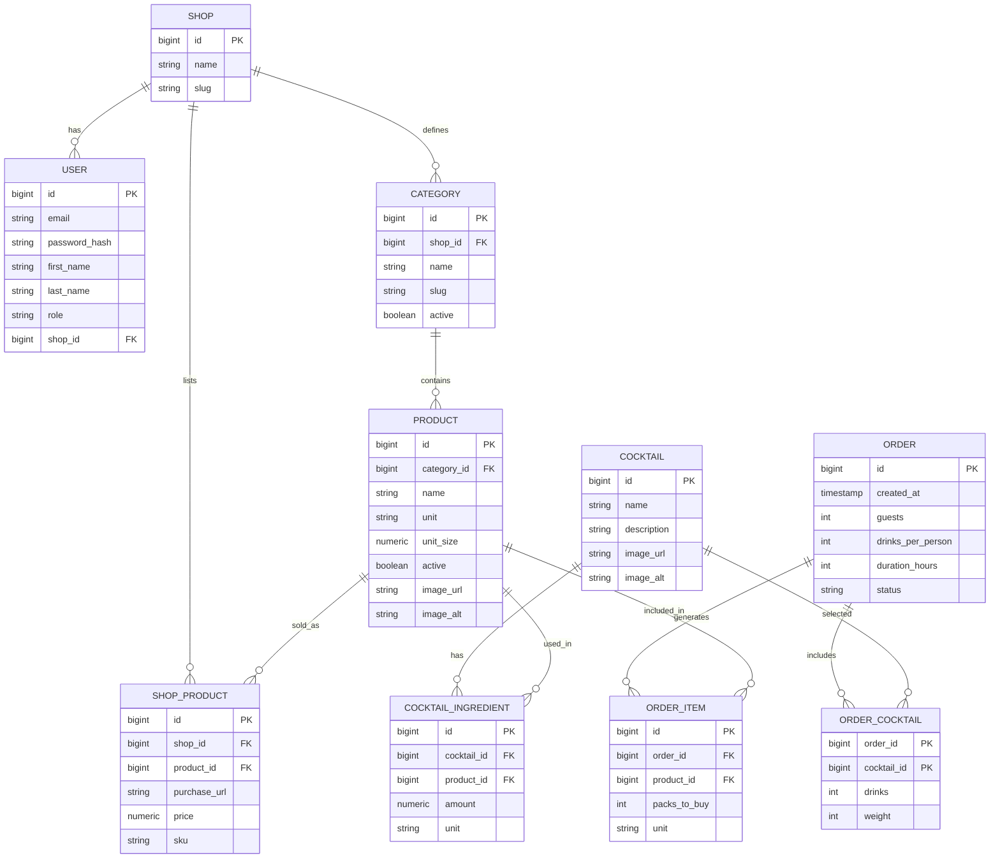
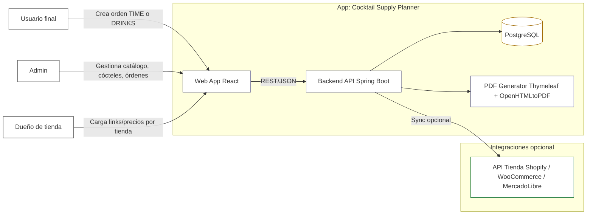
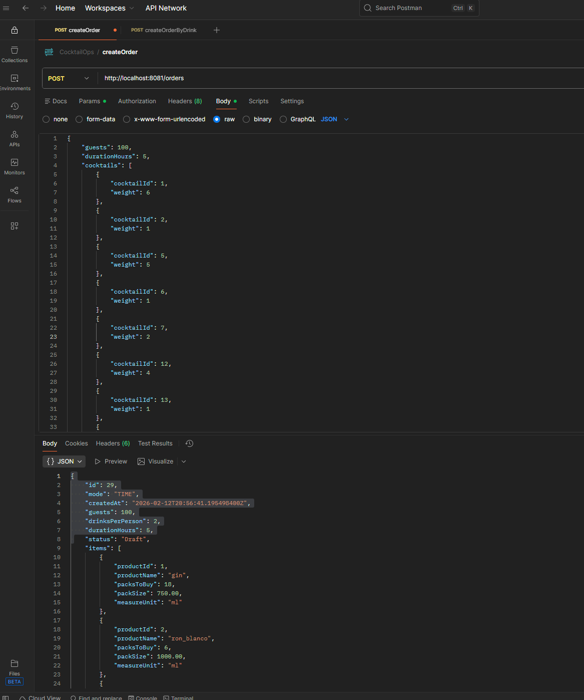
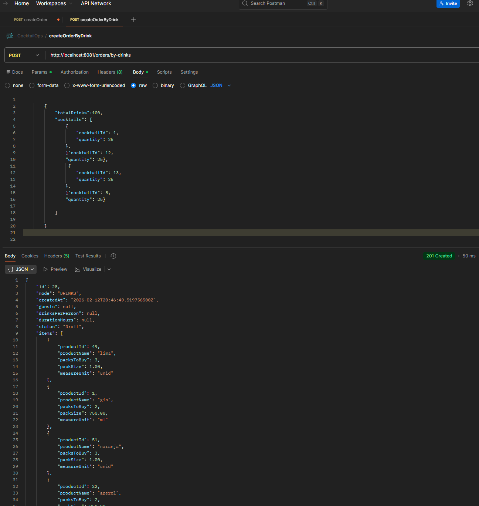
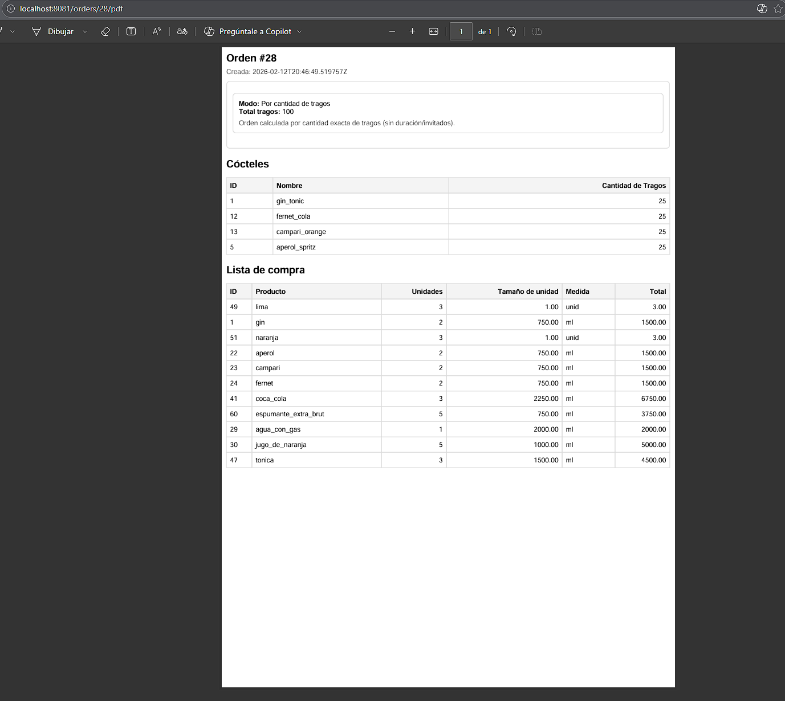

# CocktailOps


CocktailOps es una aplicación diseñada para facilitar la planificación y gestión de pedidos de cócteles para eventos. Permite a los usuarios seleccionar cócteles, calcular las cantidades necesarias de ingredientes y generar listas de compras detalladas y PDFs listos para imprimir.

## Índice
- [Decisiones Técnicas](#-decisiones-técnicas)
- [Tiempos y Alcance](#-tiempos-y-alcance-)
- [Características Principales](#características-principales)
- [Tecnologías Utilizadas](#tecnologías-utilizadas)
- [Diagramas](#diagramas)
  - [Diagrama de Entidad-Relación](#diagrama-de-entidad-relación)
  - [Diagrama de Arquitectura](#diagrama-de-arquitectura)
  - [Diagrama de Componentes](#diagrama-de-componentes)
- [Instalación y Uso](#instalación-y-uso)
  - [Requisitos Previos](#requisitos-previos)
  - [Pasos para Ejecutar la Aplicación](#pasos-para-ejecutar-la-aplicación)
  - [Creación de la Base de Datos](#creación-de-la-base-de-datos)
  - [Configuración de la Aplicación](#configuración-de-la-aplicación)
  - [Ejecucion de Docker Compose](#Ejecución-con-Docker-Compose)
  - [Ejecutar la Aplicación](#ejecutar-la-aplicación)
- [API - Ejemplos y Postman](#api---ejemplos-y-postman)
- [Testing Unitarios](#testing-unitarios)
- [Estado actual del proyecto](#estado-actual-del-proyecto)
- [Qué haría distinto / Próximos pasos](#-qué-haría-distinto--próximos-pasos)

## 🧠 Decisiones técnicas

### Arquitectura por capas (Controller → Service → Repository)
Organicé el proyecto en capas para separar responsabilidades:
- **Controller**: capa HTTP (request/response, códigos de estado, Swagger)
- **Service**: reglas de negocio (cálculo de pedidos, validaciones, orquestación)
- **Repository**: persistencia (acceso a DB con JPA)

Esto mejora mantenibilidad, testeo y escalabilidad del código.

### DTOs en lugar de exponer Entities
Uso **DTOs** para requests/responses para:
- evitar exponer el modelo de base de datos
- validar inputs con Bean Validation
- mantener estable el contrato de la API aunque cambie el modelo interno
- mejorar la documentación Swagger (schemas claros y ejemplos)

### Flyway para migraciones
Uso **Flyway** para versionar cambios de base de datos con scripts SQL:
- base reproducible entre ambientes
- cambios controlados por versión
- onboarding rápido: al levantar la app se aplican migraciones

### JPA/Hibernate como ORM
Uso **JPA + Hibernate** para mapear datos relacionales (PostgreSQL) y simplificar:
- relaciones entre entidades
- transacciones
- consultas con repositorios Spring Data

### Manejo global de errores
Centralicé errores con `@RestControllerAdvice` para:
- respuestas consistentes (400/404/409/500)
- formato uniforme (timestamp, status, message, path, etc.)
- evitar try/catch repetido en controllers

### Observabilidad básica: logging
Agregué **logs estructurados** en la capa service para:
- registrar flujos críticos (crear orden, calcular ítems, generar PDF)
- facilitar debugging con contexto (orderId, guests, duration, etc.)
- `WARN` en casos esperables (not found) y `ERROR` en fallos inesperados


## ⏱ Tiempos y alcance 
Este proyecto se desarrolla por iteraciones, priorizando primero un backend funcional, mantenible y fácil de evaluar técnicamente.

Base API + modelo + migraciones con Flyway: listo
Cálculo de pedidos TIME / DRINKS + generación de PDF: listo
Documentación Swagger + README + diagramas Mermaid: en mejora continua
Testing unitario de servicios: en progreso
ProductServiceImpl: cobertura básica completada
OrderServiceImpl: cobertura parcial en progreso
Docker + CI: próximo paso
JWT + Frontend: planificado

Objetivo: construir un backend sólido para portfolio, aplicando buenas prácticas de arquitectura, testing, documentación y mejora incremental.

## Características Principales
- **Gestión de Productos**: Almacena información sobre productos, incluyendo nombre, categoría y unidades.
- **Gestión de Cócteles**: Permite la creación y almacenamiento de recetas de cócteles con sus ingredientes y cantidades.
- **Planificación de Pedidos**: Los usuarios pueden crear pedidos especificando el número de invitados, bebidas por persona, o el total de bebidas, y la duración del evento.
- **Generación de Listas de Compras**: Calcula automáticamente las cantidades necesarias de cada ingrediente, sugiere packs a comprar y genera PDFs con la lista de compra.

## Tecnologías Utilizadas

* **Backend**: Java 17, Spring Boot
* **Base de Datos**: PostgreSQL
* **Persistencia**: Spring Data JPA / Hibernate
* **Migraciones**: Flyway
* **Build Tool**: Maven
* **Documentación API**: Swagger / OpenAPI
* **Generación PDF**: Thymeleaf + OpenHTMLToPDF
* **Testing**: JUnit 5, Mockito
* **Documentación técnica**: Markdown, Mermaid
* **Frontend**: React (planificado)
* **Autenticación**: Spring Security + JWT (planificado)
* **DevOps**: Docker / GitHub Actions (próximo paso)


## Diagramas
Los diagramas Mermaid se mantienen íntegros en este README para facilitar la lectura técnica rápida.
Mantengo los diagramas en Mermaid dentro del README para que cualquier persona 
pueda entender rápido el modelo y la arquitectura.

### Diagrama de Entidad-Relación


### Diagrama de Arquitectura


### Diagrama de Componentes

```mermaid
flowchart TB
subgraph API["API Layer"]
    C1["AuthController"]:::box
    C2["CatalogController<br/>(products + categories)"]:::box
    C3["CocktailController<br/>(cocktails + ingredients)"]:::box
    C4["OrderController<br/>(orders + pdf)"]:::box
    C5["ShopController<br/>(shops, shop_products)"]:::box
end

subgraph APP["Application/Service Layer"]
    S1["AuthService<br/>JWT + roles"]:::box
    S2["ProductService"]:::box
    S7["CategoryService"]:::box
    S3["CocktailService"]:::box
    S4["OrderService<br/>calcula packs + distribuye tragos"]:::box
    S5["PdfService<br/>genera PDF"]:::box
    S6["ShopService"]:::box
end

subgraph DOMAIN["Domain Model"]
    D7["Shop"]:::entity
    D6["User"]:::entity
    D9["Category"]:::entity
    D1["Product"]:::entity
    D8["ShopProduct"]:::entity

    D2["Cocktail"]:::entity
    D3["CocktailIngredient<br/>(amount + unit)"]:::entity

    D4["Order"]:::entity
    D10["OrderCocktail"]:::entity
    D5["OrderItem"]:::entity
end

subgraph INFRA["Infrastructure"]
    R1["Repositories (JPA)"]:::box
    FLY["Flyway Migrations"]:::box
    DB[("PostgreSQL")]:::db
end

%% Wiring
C1 --> S1
C2 --> S2
C2 --> S7
C3 --> S3
C4 --> S4
C4 --> S5
C5 --> S6

S1 --> R1
S2 --> R1
S7 --> R1
S3 --> R1
S4 --> R1
S6 --> R1

R1 --> DB
FLY --> DB

classDef box fill:#000000,stroke:#5a5a8a,stroke-width:1px;
classDef db fill:#000000,stroke:#a06a00,stroke-width:1px;
classDef entity fill:#000000,stroke:#1f7a3a,stroke-width:1px;
```



## Instalación y Uso

### Requisitos Previos
- Java 17 o superior
- Maven 3.6.3 o superior
- PostgreSQL 13 o superior
- Docker Desktop y Docker Compose para levantar PostgreSQL localmente


### Pasos para Ejecutar la Aplicación
1. Clona el repositorio:

```bash
git clone https://github.com/Fran3103/CocktailOps.git
cd CocktailOps
```

2. Asegúrate de crear la base de datos (ver sección siguiente) y de tener las credenciales configuradas.

### Creación de la Base de Datos
Ejecuta en tu servidor PostgreSQL:

```sql
CREATE DATABASE cocktailops;
```

### Configuración de la Aplicación

Para ejecutar la aplicación en entorno local, crear el archivo:

```txt
src/main/resources/application-local.properties
```

Puede tomarse como base el archivo:

```txt
src/main/resources/application-local.example.properties
```

Ejemplo de configuración local usando PostgreSQL levantado con Docker Compose:

```properties
server.port=8081

spring.datasource.url=jdbc:postgresql://localhost:5433/cocktailOps_db?sslmode=disable
spring.datasource.username=postgres
spring.datasource.password=admin
spring.datasource.driver-class-name=org.postgresql.Driver

spring.flyway.enabled=true
spring.flyway.locations=classpath:db/migration

spring.jpa.hibernate.ddl-auto=validate

order.drinksPerPersonPerHour=2
```

> El archivo `application-local.properties` no debe versionarse porque puede contener credenciales locales. Para compartir configuración de ejemplo, usar `application-local.example.properties`.

### Ejecución con Docker Compose

El proyecto incluye un archivo `docker-compose.yml` para levantar una base de datos PostgreSQL local sin instalar ni configurar PostgreSQL manualmente.

> En Windows, asegurarse de tener **Docker Desktop abierto** antes de ejecutar los comandos.

Levantar PostgreSQL:

```bash
docker compose up -d
```

Verificar que el contenedor esté corriendo:

```bash
docker compose ps
```

Luego ejecutar la aplicación con el perfil `local`:

```bash
mvn spring-boot:run "-Dspring-boot.run.profiles=local"
```

Si la aplicación levanta correctamente, Swagger UI estará disponible en:

```txt
http://localhost:8081/swagger-ui/index.html
```

Para apagar PostgreSQL sin borrar los datos:

```bash
docker compose down
```

Para apagar PostgreSQL y borrar también el volumen de datos:

```bash
docker compose down -v
```

> Usar `docker compose down -v` solo si se quiere reiniciar completamente la base de datos local.


### Ejecutar la Aplicación
Con PostgreSQL en ejecución:

```bash
mvn clean spring-boot:run "-Dspring-boot.run.profiles=local"
```

O empaqueta y ejecuta el jar:

```bash
mvn -DskipTests package
java -jar target/cocktailops-*.jar --spring.profiles.active=local
```

Swagger UI (si está habilitado):

```
http://localhost:8081/swagger-ui/index.html
```


## API - Ejemplos y Postman
A continuación se muestran los ejemplos principales usados en Postman (las capturas se encuentran en `docs/postman/`).

### 1) Crear Order (modo TIME — por invitados + duración)

**Body (JSON)**
```json
{
  "guests": 100,
  "durationHours": 5,
  "cocktails": [
    { "cocktailId": 1, "weight": 5 },
    { "cocktailId": 2, "weight": 4 }
  ]
}
```



### 2) Crear Order (modo DRINKS — por total de bebidas)

**Body (JSON)**
```json
{
  "totalDrinks": 100,
  "cocktails": [
    { "cocktailId": 1, "quantity": 25 },
    { "cocktailId": 12, "quantity": 25 },
    { "cocktailId": 13, "quantity": 25 },
    { "cocktailId": 5, "quantity": 25 }
  ]
}
```



### PDF
El servicio puede generar un PDF con la lista de compra y el detalle del pedido.



## Testing unitario

El proyecto incorpora tests unitarios en la capa service usando JUnit 5 y Mockito.

Estado actual:

* **ProductServiceImpl**: cobertura básica completada

  * búsqueda por ID
  * creación
  * actualización
  * eliminación
  * búsqueda por nombre
  * búsqueda por categoría
  * listado general
  * validaciones y excepciones principales

* **OrderServiceImpl**: cobertura parcial en progreso

  * búsqueda por ID
  * listado general
  * validaciones iniciales de creación de órdenes

Objetivo de testing:

* Validar caminos felices y caminos alternativos
* Asegurar reglas de negocio principales
* Probar excepciones controladas
* Evitar dependencia de base de datos real en tests unitarios

## Estado actual del proyecto

* **Backend API**: listo
* **Cálculo de órdenes TIME / DRINKS**: listo
* **Generación de PDF**: listo
* **Swagger / documentación API**: listo, en mejora continua
* **Tests unitarios**: en progreso

  * `ProductServiceImpl`: cobertura básica completada
  * `OrderServiceImpl`: cobertura parcial en progreso
* **Perfil de testing**: listo

  * Tests configurados con perfil `test`
  * Base H2 en memoria para evitar dependencia de PostgreSQL local
* **Docker Compose**: listo

  * PostgreSQL local levantado con `docker compose`
  * Aplicación ejecutada localmente con perfil `local`
* **GitHub Actions CI**: listo

  * Build y tests automáticos en cada push / pull request a `master`
* **Spring Security + JWT**: próximo paso
* **Frontend**: planificado

## 🔄 Qué haría distinto / Próximos pasos

* Aumentar cobertura de tests en services y controllers
* Agregar autenticación con **Spring Security + JWT**
* Proteger endpoints según roles simples, por ejemplo `USER` y `ADMIN`
* Actualizar Swagger/Postman con el flujo de autenticación
* Evaluar Dockerizar también la aplicación Spring Boot, no solo PostgreSQL
* Preparar una demo visual o frontend mínimo para mostrar el flujo principal
* Agregar documentación QA cuando avance el curso de QA Manual
* Evaluar a futuro una página compartible de orden con links de compra
