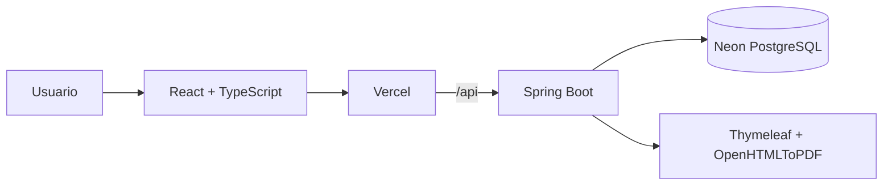

# CocktailOps


**CocktailOps** es una aplicación full stack para planificar barras de cócteles para eventos. Permite seleccionar una carta, estimar la cantidad de tragos, distribuir el consumo según prioridades, calcular ingredientes y formatos de compra, generar una lista consolidada y descargar un PDF listo para usar.

La aplicación funciona tanto para visitantes como para usuarios registrados y cuenta con autenticación JWT, roles, historial, ownership de órdenes, catálogo real, generación de PDF, testing, CI/CD y despliegue cloud.

> **Demo:** https://cocktailops.vercel.app  
> **Repositorio:** https://github.com/Fran3103/CocktailOps  
> **Estado:** versión portfolio funcional y desplegada.

---

## Índice

- [Problema que resuelve](#problema-que-resuelve)
- [Demo y estado actual](#demo-y-estado-actual)
- [Flujos principales](#flujos-principales)
- [Arquitectura](#arquitectura)
- [Tecnologías](#tecnologías)
- [Backend](#backend)
- [Frontend](#frontend)
- [Motor de cálculo](#motor-de-cálculo)
- [Productos preparados](#productos-preparados)
- [PDF y lista de compra](#pdf-y-lista-de-compra)
- [Autenticación y permisos](#autenticación-y-permisos)
- [Catálogo y presets](#catálogo-y-presets)
- [Testing](#testing)
- [Base de datos y migraciones](#base-de-datos-y-migraciones)
- [Deploy e infraestructura](#deploy-e-infraestructura)
- [CI/CD](#cicd)
- [Ejecución local](#ejecución-local)
- [Estructura del repositorio](#estructura-del-repositorio)
- [Alcance de la versión portfolio](#alcance-de-la-versión-portfolio)
- [Módulo Shop y evolución futura](#módulo-shop-y-evolución-futura)
- [Documentación](#documentación)
- [Autor](#autor)

---

# Problema que resuelve

En una barra de eventos no alcanza con conocer la receta de un cóctel. También hay que responder preguntas operativas como:

- ¿cuántos tragos se van a preparar?
- ¿cómo se distribuyen entre las distintas opciones?
- ¿cuánto se necesita de cada ingrediente?
- ¿cuántas botellas, packs o unidades hay que comprar?
- ¿cómo se evita calcular el mismo producto varias veces?
- ¿qué productos se compran y cuáles se preparan previamente?
- ¿cómo se entrega una lista usable al equipo?

CocktailOps transforma:

```txt
Invitados
+ duración
+ selección de cócteles
+ prioridades
```

o bien:

```txt
Cantidad exacta de tragos
+ cantidades por cóctel
```

en:

```txt
Distribución de cócteles
→ ingredientes requeridos
→ productos preparados
→ consolidación de insumos
→ formatos de compra
→ hielo
→ lista final
→ PDF
```

---

# Demo y estado actual

La aplicación está desplegada y operativa:

```txt
https://cocktailops.vercel.app
```

## Estado general

| Área | Estado |
|---|---|
| Backend Spring Boot | Implementado |
| Frontend React | Implementado |
| PostgreSQL | Implementado |
| Flyway | Implementado |
| Catálogo de productos | Implementado |
| Catálogo ampliado de cócteles | Implementado |
| Tipos de preparación | Implementado |
| Modo TIME | Implementado |
| Modo DRINKS | Implementado |
| Prioridades de cócteles | Implementado |
| Productos preparados / subrecetas | Implementado |
| Almíbar → azúcar | Implementado |
| Hielo global | Implementado |
| PDF | Implementado |
| Registro / Login | Implementado |
| JWT | Implementado |
| Roles USER / ADMIN | Implementado |
| Historial | Implementado |
| Ownership de órdenes | Implementado |
| Dashboards por rol | Implementado |
| Responsive mobile / desktop | Implementado |
| Backend Oracle Cloud | Implementado |
| Base Neon PostgreSQL | Implementado |
| Frontend Vercel | Implementado |
| Proxy Vercel → backend | Implementado |
| GitHub Actions CI/CD | Implementado |
| Rollback automático | Implementado |
| Tests backend | 40 tests en verde |
| Swagger/OpenAPI final | En actualización |
| README backend/frontend/general | En actualización |
| Integración de tiendas/carrito | Futuro |
| CRUD administrativo visual | Futuro |

---

# Flujos principales

## Invitado

Un visitante puede usar la funcionalidad principal sin crear una cuenta:

```txt
Entrar a CocktailOps
→ consultar cócteles y productos
→ crear una orden
→ elegir un preset o seleccionar cócteles
→ definir prioridades o cantidades
→ calcular
→ ver resultado temporal
→ descargar PDF preview
```

La orden del invitado:

```txt
no se persiste
no tiene ID real
no aparece en historial
```

---

## Usuario registrado

```txt
Registro / Login
→ Dashboard USER
→ Crear orden
→ Guardar orden
→ Consultar historial propio
→ Ver detalle
→ Descargar PDF
```

Las órdenes quedan asociadas al usuario autenticado.

---

## Administrador

```txt
Login ADMIN
→ Dashboard administrativo
→ Métricas generales
→ Historial global
→ Detalle de órdenes
→ Descarga de PDFs
```

En la versión actual, el rol `ADMIN` está utilizado principalmente para el acceso global a órdenes.

El backend ya protege operaciones administrativas de catálogo, pero el frontend no incluye todavía un panel CRUD completo de productos, cócteles y categorías.

---

# Arquitectura

## Arquitectura general



---

## Backend

```txt
Controller
   ↓
Service
   ↓
Repository
   ↓
PostgreSQL
```

La lógica de negocio se concentra en los servicios y la API utiliza DTOs en lugar de exponer entidades JPA directamente.

---

## Frontend

El frontend se organiza por features:

```txt
auth
cocktails
dashboard
orders
products
profiles
```

La comunicación HTTP se centraliza mediante Axios y los flujos complejos de órdenes se separan en hooks, helpers, services y componentes reutilizables.

---

# Tecnologías

## Backend

- Java 17
- Spring Boot 4.0.2
- Spring Web MVC
- Spring Data JPA
- Hibernate
- PostgreSQL
- Flyway
- Spring Security
- JWT / JJWT
- Bean Validation
- Maven
- Lombok
- Swagger / OpenAPI
- Thymeleaf
- OpenHTMLToPDF
- JUnit 5
- Mockito
- H2

## Frontend

- React
- Vite
- TypeScript
- Tailwind CSS
- React Router
- Axios
- Lucide React
- ESLint
- npm

## Infraestructura

- Docker Compose
- GitHub Actions
- Oracle Cloud Infrastructure
- Ubuntu 24.04
- systemd
- Neon PostgreSQL
- Vercel
- SSH / SCP

---

# Backend

El backend contiene el núcleo de CocktailOps.

Responsabilidades principales:

- autenticación;
- autorización;
- catálogo;
- recetas;
- cálculo de órdenes;
- distribución de cócteles;
- conversión de unidades;
- productos preparados;
- packs;
- hielo;
- persistencia;
- ownership;
- historial;
- generación de PDF;
- límites de uso.

Documentación específica:

```txt
backend/README.md
```

---

# Frontend

El frontend convierte la API en una aplicación web usable.

Incluye:

- dashboard público;
- dashboard USER;
- dashboard ADMIN;
- login;
- registro;
- sesión JWT;
- catálogo de cócteles;
- buscador;
- filtros por preparación;
- catálogo de productos;
- filtros;
- creación de orden en pasos;
- presets;
- prioridades visuales;
- historial;
- detalle;
- PDF;
- 403;
- 404;
- estados de carga;
- estados vacíos;
- errores específicos;
- diseño responsive.

Documentación específica:

```txt
frontend/README.md
```

---

# Motor de cálculo

CocktailOps soporta dos formas de crear órdenes.

---

## Modo TIME

El usuario indica:

```txt
invitados
duración
cócteles
prioridad por cóctel
```

La fórmula base es:

```txt
totalDrinks = guests × durationHours × drinksPerPersonPerHour
```

La estimación actual utiliza:

```txt
1 trago por persona por hora
```

Ejemplo:

```txt
290 invitados
× 6 horas
× 1 trago/persona/hora

= 1740 tragos
```

No existe una regla adicional que duplique automáticamente el consumo por tratarse de un evento grande.

---

## Prioridades

Para evitar que el usuario tenga que manejar números técnicos, el frontend muestra prioridades:

| Prioridad | Weight |
|---|---:|
| Baja | `1` |
| Normal | `2` |
| Media | `3` |
| Alta | `4` |

Reglas:

```txt
mínimo = 1
máximo = 4
default = 2
```

`0` no se utiliza. Para excluir un cóctel, se elimina de la selección.

---

## Distribución por pesos

Ejemplo:

```txt
Total: 100 tragos

Mojito      → 1
Daiquiri    → 1
Gin Tonic   → 2
```

Resultado:

```txt
Mojito      → 25
Daiquiri    → 25
Gin Tonic   → 50
```

Cuando aparecen decimales, el backend distribuye los restos garantizando que:

```txt
suma de cócteles = totalDrinks
```

---

## Modo DRINKS

En este modo no se utilizan invitados ni duración.

Ejemplo:

```json
{
  "totalDrinks": 100,
  "cocktails": [
    { "cocktailId": 1, "quantity": 40 },
    { "cocktailId": 2, "quantity": 35 },
    { "cocktailId": 3, "quantity": 25 }
  ]
}
```

Regla:

```txt
40 + 35 + 25 = 100
```

La suma debe coincidir exactamente con `totalDrinks`.

---

## Acumulación de ingredientes

CocktailOps no calcula botellas individualmente por cada cóctel.

Ejemplo:

```txt
Mojito usa Ron
Daiquiri usa Ron
```

El sistema:

```txt
suma todo el Ron
→ obtiene la cantidad total requerida
→ recién después calcula botellas
```

Esto evita duplicar formatos de compra.

---

## Conversión de unidades

Unidades principales:

```txt
ML
GR
UNID
OZ
```

Conversiones soportadas:

```txt
OZ → ML
OZ → GR
```

El motor evita conversiones conceptualmente inválidas como:

```txt
UNID → ML
UNID → GR
```

---

## Formatos de compra

Ejemplo:

```txt
Ron requerido = 1600 ml
Botella       = 750 ml

1600 / 750 = 2.13
→ comprar 3 botellas
```

Se utiliza redondeo hacia arriba porque los productos se compran en presentaciones completas.

---

## Hielo

El hielo se calcula de manera global y no forma parte de cada receta.

Regla actual:

```txt
1 bolsa de 15 kg cada 55 tragos
```

Ejemplo:

```txt
1740 / 55 = 31.63
→ 32 bolsas
```

---

# Productos preparados

CocktailOps distingue entre:

```txt
purchasable = true
→ producto comprado

purchasable = false
→ producto preparado
```

Los productos preparados se expanden antes de calcular los packs finales.

---

## Almíbar simple

El primer caso implementado es:

```txt
1000 g de azúcar
+ agua
≈ 1600 ml de almíbar
```

El agua no se registra como compra.

Flujo:

```txt
Cócteles necesitan almíbar
→ calcular almíbar total
→ convertir a azúcar necesaria
→ sumar con azúcar directa
→ calcular packs de azúcar
```

Por eso el almíbar no aparece como producto final a comprar.

El diseño soporta expansión recursiva y detección de ciclos entre productos preparados.

---

# PDF y lista de compra

Los PDFs se generan con:

```txt
Thymeleaf
+ OpenHTMLToPDF
```

## PDF de invitado

Se genera desde un preview y no requiere persistir una orden.

## PDF de usuario

Se genera a partir de una orden persistida y respeta ownership.

## Contenido

El documento muestra:

- fecha;
- modo;
- invitados y duración si corresponde;
- total de tragos;
- cócteles distribuidos;
- total de cócteles;
- lista de compra;
- cantidad de packs;
- presentación;
- medida;
- total disponible;
- total de unidades de compra;
- aclaración sobre redondeo.

La lista representa una estimación suficiente para preparar los tragos calculados. Puede existir sobrante debido al redondeo de presentaciones comerciales.

---

# Autenticación y permisos

CocktailOps utiliza Spring Security + JWT con una arquitectura stateless.

```http
Authorization: Bearer <token>
```

## Accesos principales

| Recurso | Acceso |
|---|---|
| Health | Público |
| Swagger / OpenAPI | Público |
| Registro / Login | Público |
| Lectura de catálogo | Público |
| Preview de orden | Público |
| PDF preview | Público |
| Crear orden persistida | Autenticado |
| Historial propio | Autenticado |
| Detalle de orden | Dueño / ADMIN |
| PDF persistido | Dueño / ADMIN |
| Historial global | ADMIN |
| Escritura de catálogo | ADMIN |
| `/shop/**` | ADMIN |

---

## Ownership

```txt
USER
→ solo puede consultar órdenes propias

ADMIN
→ puede consultar cualquier orden
```

Esto se aplica al detalle y a la descarga de PDFs persistidos.

---

## Límite de uso

Cada usuario puede persistir:

```txt
25 órdenes
dentro de una ventana de 24 horas
```

Al alcanzar el límite:

```http
429 Too Many Requests
```

Los previews de invitados no cuentan porque no se guardan.

---

# Catálogo y presets

El catálogo de demo está versionado mediante Flyway.

Incluye:

- categorías;
- productos;
- descripciones;
- unidades;
- formatos de compra;
- imágenes;
- cócteles;
- recetas;
- tipos de preparación.

Tipos de preparación:

```txt
DIRECT
SHAKEN
STIRRED
FROZEN
```

---

## Listas rápidas

El frontend incorpora presets como:

- Clásicos simples
- Clásicos completos
- Boda / evento elegante
- Modernos y fiesta
- Verano / tropical
- Aperitivos
- Premium clásico
- Popular y rápido

Los presets buscan los cócteles por nombre dentro del catálogo recibido desde backend, en lugar de depender de IDs hardcodeados.

Después de aplicar un preset, el usuario puede modificar libremente la selección.

---

# Testing

El backend cuenta actualmente con:

```txt
40 tests en verde
```

La suite utiliza:

- JUnit 5
- Mockito
- H2
- Spring Boot Test

Áreas cubiertas:

- contexto Spring;
- productos;
- cócteles;
- órdenes;
- validaciones;
- duplicados;
- recursos inexistentes;
- distribución por prioridades;
- cálculo de packs;
- límite de órdenes;
- productos preparados;
- hielo.

Casos destacados:

```txt
weight entre 1 y 4
default Normal = 2
suma exacta de cócteles
almíbar convertido a azúcar
1740 tragos → 32 bolsas de hielo
límite de 25 órdenes / 24 h
```

Ejecutar:

```bash
cd backend
./mvnw test
```

Windows:

```powershell
cd backend
.\mvnw.cmd test
```

El frontend tiene build y lint funcionales. Los tests automatizados de UI quedan como mejora futura no bloqueante para esta versión portfolio.

---

# Base de datos y migraciones

## Local

Docker Compose levanta:

```txt
PostgreSQL 16
localhost:5434
cocktailOps_db
```

## Demo

La base remota está alojada en:

```txt
Neon PostgreSQL
```

---

## Flyway

Las migraciones cubren la evolución completa del sistema.

Entre los últimos cambios:

```txt
V11 → descripción de productos
V12 → ampliación del catálogo
V13 → tipos de preparación
V14 → hielo fuera de recetas individuales
V15 → ajuste de recetas
V16 → productos preparados / subrecetas
```

Las migraciones se consideran inmutables una vez aplicadas.

---

# Deploy e infraestructura

## Frontend

```txt
React
→ Vercel
→ https://cocktailops.vercel.app
```

En producción:

```env
VITE_API_BASE_URL=/api
```

Vercel utiliza un rewrite para enviar las requests `/api/*` al backend.

---

## Backend

```txt
Spring Boot JAR
→ Oracle Cloud VM
→ Ubuntu 24.04
→ systemd
```

Servicio:

```txt
cocktailops.service
```

La aplicación arranca automáticamente después de un reboot.

---

## Base de datos

```txt
Oracle Backend
→ JDBC
→ Neon PostgreSQL
```

---

## Health check

```http
GET /healthz
```

Respuesta:

```json
{
  "status": "ok"
}
```

---

# CI/CD

Workflow:

```txt
.github/workflows/ci.yml
```

## Pull Request hacia master

```txt
checkout
→ Java 17
→ Maven
→ build
→ tests
```

## Push a master

```txt
build
→ tests
→ generar JAR
→ SCP
→ Oracle
→ backup del JAR anterior
→ reemplazar versión
→ restart systemd
→ health check
```

---

## Rollback

Si la nueva versión no supera el health check:

```txt
deploy falla
→ restaurar cocktailops.jar.bak
→ reiniciar servicio
→ comprobar health
```

El pipeline permanece fallido aunque el rollback sea exitoso, dejando visible que la nueva versión no pudo desplegarse.

---

# Ejecución local

## 1. Clonar

```bash
git clone https://github.com/Fran3103/CocktailOps.git
cd CocktailOps
```

---

## 2. PostgreSQL

```bash
docker compose up -d
```

Base local:

```txt
localhost:5434
```

---

## 3. Backend

Crear:

```txt
backend/src/main/resources/application-local.properties
```

tomando como base:

```txt
backend/src/main/resources/application-local.example.properties
```

Ejecutar en Windows:

```powershell
cd backend
.\mvnw.cmd spring-boot:run "-Dspring-boot.run.profiles=local"
```

Backend local:

```txt
http://localhost:8081
```

Swagger:

```txt
http://localhost:8081/swagger-ui/index.html
```

---

## 4. Frontend

```bash
cd frontend
npm install
npm run dev
```

Crear:

```txt
frontend/.env.local
```

con:

```env
VITE_API_BASE_URL=http://localhost:8081
```

Frontend:

```txt
http://localhost:5173
```

---

# Estructura del repositorio

```txt
CocktailOps/
├── .github/
│   └── workflows/
│       └── ci.yml
├── backend/
│   ├── src/
│   ├── pom.xml
│   └── README.md
├── frontend/
│   ├── src/
│   ├── package.json
│   ├── vercel.json
│   └── README.md
├── docs/
├── docker-compose.yml
├── README.md
└── .gitignore
```

---

# Alcance de la versión portfolio

CocktailOps nació como una idea más amplia, pero esta versión tiene un alcance deliberadamente cerrado.

## Funcionalidades terminadas

```txt
Catálogo
+ autenticación
+ órdenes
+ cálculo
+ recetas
+ productos preparados
+ PDF
+ historial
+ permisos
+ frontend
+ backend
+ base de datos
+ testing
+ deploy
+ CI/CD
```

La aplicación puede utilizarse de punta a punta.

---

## No forman parte de esta versión

- panel CRUD completo de administración;
- integración automática con tiendas;
- carrito de compra;
- comparación de proveedores;
- pagos;
- confirmación de email;
- recuperación de contraseña;
- rate limiting por IP;
- ajuste automático por clima;
- optimización según stock previo.

Estas mejoras no son necesarias para considerar la versión portfolio terminada.

---

# Módulo Shop y evolución futura

El backend ya contiene una base para trabajar con tiendas:

```txt
Shop
ShopController
ShopService
ShopRepository
DTOs
```

Actualmente este módulo no está integrado al flujo principal del frontend.

La visión futura es:

```txt
Orden
→ lista calculada
→ productos de Shop
→ matching
→ enlaces de compra / carrito
```

La idea sería permitir que el usuario, después de generar una lista, pueda opcionalmente:

- abrir productos en una tienda;
- generar enlaces de compra;
- crear un carrito;
- consultar diferentes proveedores.

Esta funcionalidad se dejó fuera de la V1 para evitar convertir el proyecto de portfolio en un producto sin fin.

---

# Documentación

La documentación se divide en tres niveles:

## General

```txt
README.md
```

Explica el producto completo y su arquitectura.

## Backend

```txt
backend/README.md
```

Incluye el motor de cálculo, seguridad, API, testing, migraciones, PDF, infraestructura y CI/CD.

## Frontend

```txt
frontend/README.md
```

Incluye arquitectura de UI, rutas, flujos, presets, prioridades, integración con backend y deploy.

## Swagger / OpenAPI

La documentación interactiva de endpoints se encuentra en Swagger.

En local:

```txt
http://localhost:8081/swagger-ui/index.html
```

La revisión final de ejemplos, códigos HTTP y descripciones forma parte del cierre documental del proyecto.

---

# Próximo cierre

Antes de publicar formalmente el proyecto como pieza de portfolio quedan principalmente tareas de presentación:

```txt
Swagger/OpenAPI final
→ revisar README backend
→ revisar README frontend
→ README general
→ smoke final
→ capturas del proyecto
→ publicación
```

No se planean nuevas funcionalidades grandes antes de su presentación, salvo que aparezca un bug real durante la validación final.

---

# Autor

Proyecto desarrollado por **Franco Aguirre** como proyecto full stack de portfolio.

Áreas aplicadas:

- Java
- Spring Boot
- REST APIs
- PostgreSQL
- Flyway
- Spring Security
- JWT
- React
- TypeScript
- Testing
- CI/CD
- Oracle Cloud
- Neon PostgreSQL
- Vercel
- PDF
- QA funcional

