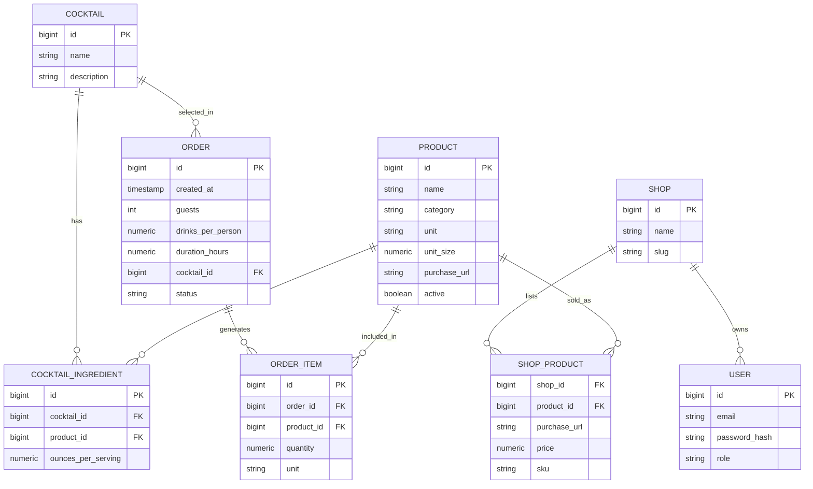

# CocktailOps  
CocktailOps es una aplicación diseñada para facilitar la planificación y gestión de pedidos de cócteles para eventos. Permite a los usuarios seleccionar cócteles, calcular las cantidades necesarias de ingredientes y generar listas de compras detalladas.

## Características Principales
- **Gestión de Productos**: Almacena información sobre productos, incluyendo nombre, categoría.
- **Gestión de Cócteles**: Permite la creación y almacenamiento de recetas de cócteles con sus ingredientes y cantidades.
- **Planificación de Pedidos**: Los usuarios pueden crear pedidos especificando el número de invitados, bebidas por persona y duración del evento.
- **Generación de Listas de Compras**: Calcula automáticamente las cantidades necesarias de cada ingrediente y genera una lista de compras.

## Tecnologías Utilizadas
- Backend: Java con Spring Boot
- Base de Datos: PostgreSQL
- ORM: Hibernate
- Control de Versiones: Git
- Documentación: Markdown
- Diagramas: Mermaid
- Frontend: React (en desarrollo)
- Autenticación: JWT (en desarrollo)
- Pruebas: JUnit y Mockito (en desarrollo)


## Diagrama de Entidad-Relación


## Diagrama de Arquitectura
```mermaid
flowchart LR
%% Actors
U[Usuario final]:::actor
A[Admin]:::actor
S[Dueño de tienda]:::actor

%% System
subgraph SYS[App: Cocktail Supply Planner]
FE[Web App (React)]:::box
BE[Backend API (Spring Boot)]:::box
DB[(PostgreSQL)]:::db
PDF[PDF Generator\n(Thymeleaf + OpenHTMLtoPDF)]:::box
end

%% Optional external integrations
subgraph EXT[Integraciones (opcional)]
SHOPAPI[API Tienda\nShopify / WooCommerce / MercadoLibre]:::ext
end

U -->|Selecciona cóctel + invitados +\ntragos/persona + duración| FE
A -->|Gestiona catálogo, cócteles,\nórdenes| FE
S -->|Carga links/precios de productos\npor tienda| FE

FE -->|REST/JSON| BE
BE --> DB
BE --> PDF
BE -->|Links/Sync opcional| SHOPAPI

classDef actor fill:#fff,stroke:#444,stroke-width:1px;
classDef box fill:#f7f7ff,stroke:#5a5a8a,stroke-width:1px;
classDef db fill:#fff6e6,stroke:#a06a00,stroke-width:1px;
classDef ext fill:#eefbf3,stroke:#1f7a3a,stroke-width:1px;
```  


## Diagrama de Componentes

```mermaid
flowchart TB
subgraph API[API Layer]
C1[AuthController]:::box
C2[CatalogController\n(products)]:::box
C3[CocktailController\n(cocktails)]:::box
C4[OrderController\n(orders + pdf)]:::box
C5[ShopController\n(shops, shop_products)]:::box
end

subgraph APP[Application/Service Layer]
S1[AuthService\nJWT + roles]:::box
S2[ProductService]:::box
S3[CocktailService]:::box
S4[OrderService\ncalcula cantidades]:::box
S5[PdfService\ngenera PDF]:::box
S6[ShopService]:::box
end

subgraph DOMAIN[Domain Model]
D1[Product]:::entity
D2[Cocktail]:::entity
D3[CocktailIngredient]:::entity
D4[Order]:::entity
D5[OrderItem]:::entity
D6[User]:::entity
D7[Shop]:::entity
D8[ShopProduct]:::entity
end

subgraph INFRA[Infrastructure]
R1[Repositories (JPA)]:::box
FLY[Flyway Migrations]:::box
DB[(PostgreSQL)]:::db
end

%% Wiring
C1 --> S1
C2 --> S2
C3 --> S3
C4 --> S4
C4 --> S5
C5 --> S6

S2 --> R1
S3 --> R1
S4 --> R1
S6 --> R1

R1 --> DB
FLY --> DB

S2 --> D1
S3 --> D2
S3 --> D3
S4 --> D4
S4 --> D5
S1 --> D6
S6 --> D7
S6 --> D8

classDef box fill:#f7f7ff,stroke:#5a5a8a,stroke-width:1px;
classDef db fill:#fff6e6,stroke:#a06a00,stroke-width:1px;
classDef entity fill:#f6fffb,stroke:#1f7a3a,stroke-width:1px;
```


## Instalación y Uso

### Requisitos Previos
- Java 17 o superior
- Maven 3.6.3 o superior
- PostgreSQL 13 o superior
- Spring Boot 4.0.2 o superior

### Pasos para Ejecutar la Aplicación
1. Clona el repositorio: `git clone https://github.com/fran3103/CocktailOps.git`
2. Navega al directorio del proyecto: `cd CocktailOps`

#### Creación de la Base de Datos
Antes de ejecutar la aplicación, crea una base de datos PostgreSQL para almacenar los datos de la aplicación. Puedes hacerlo ejecutando el siguiente comando SQL en tu servidor PostgreSQL:
```sql
CREATE DATABASE cocktailops;
```

### Configuración de la Aplicación
1. Abre el archivo `src/main/resources/application-local.properties`.

2. Actualiza las siguientes propiedades según tu configuración de base de datos:
```properties
   spring.profiles.active=local
   server.port=8080

spring.datasource.url=jdbc:postgresql://localhost:5432/cocktailops
spring.datasource.username=postgres
spring.datasource.password=postgres
spring.datasource.driver-class-name=org.postgresql.Driver

spring.flyway.enabled=true
spring.flyway.locations=classpath:db/migration

spring.jpa.hibernate.ddl-auto=validate
```


### Ejecutar la Aplicación
1. Asegúrate de tener PostgreSQL en ejecución.
2. Ejecuta:

```bash
mvn clean spring-boot:run -Dspring-boot.run.profiles=local

