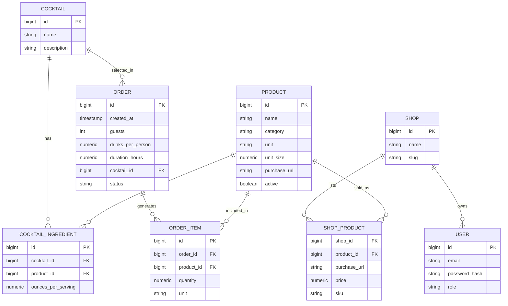

```mermaid
erDiagram
  PRODUCT {
    bigint id PK
    string name
    string category
    string unit
    numeric unit_size
    string purchase_url
    boolean active
  }

  COCKTAIL {
    bigint id PK
    string name
    string description
  }

  COCKTAIL_INGREDIENT {
    bigint id PK
    bigint cocktail_id FK
    bigint product_id FK
    numeric ounces_per_serving
  }

  "ORDER" {
    bigint id PK
    timestamp created_at
    int guests
    numeric drinks_per_person
    numeric duration_hours
    bigint cocktail_id FK
    string status
  }

  ORDER_ITEM {
    bigint id PK
    bigint order_id FK
    bigint product_id FK
    numeric quantity
    string unit
  }

  USER {
    bigint id PK
    string email
    string password_hash
    string role
  }

  SHOP {
    bigint id PK
    string name
    string slug
  }

  SHOP_PRODUCT {
    bigint shop_id FK
    bigint product_id FK
    string purchase_url
    numeric price
    string sku
  }

  COCKTAIL ||--o{ COCKTAIL_INGREDIENT : has
  PRODUCT  ||--o{ COCKTAIL_INGREDIENT : used_in

  COCKTAIL ||--o{ "ORDER"     : selected_in
  "ORDER"  ||--o{ ORDER_ITEM  : generates
  PRODUCT  ||--o{ ORDER_ITEM  : included_in

  SHOP ||--o{ USER : owns
  SHOP ||--o{ SHOP_PRODUCT : lists
  PRODUCT ||--o{ SHOP_PRODUCT : sold_as
```