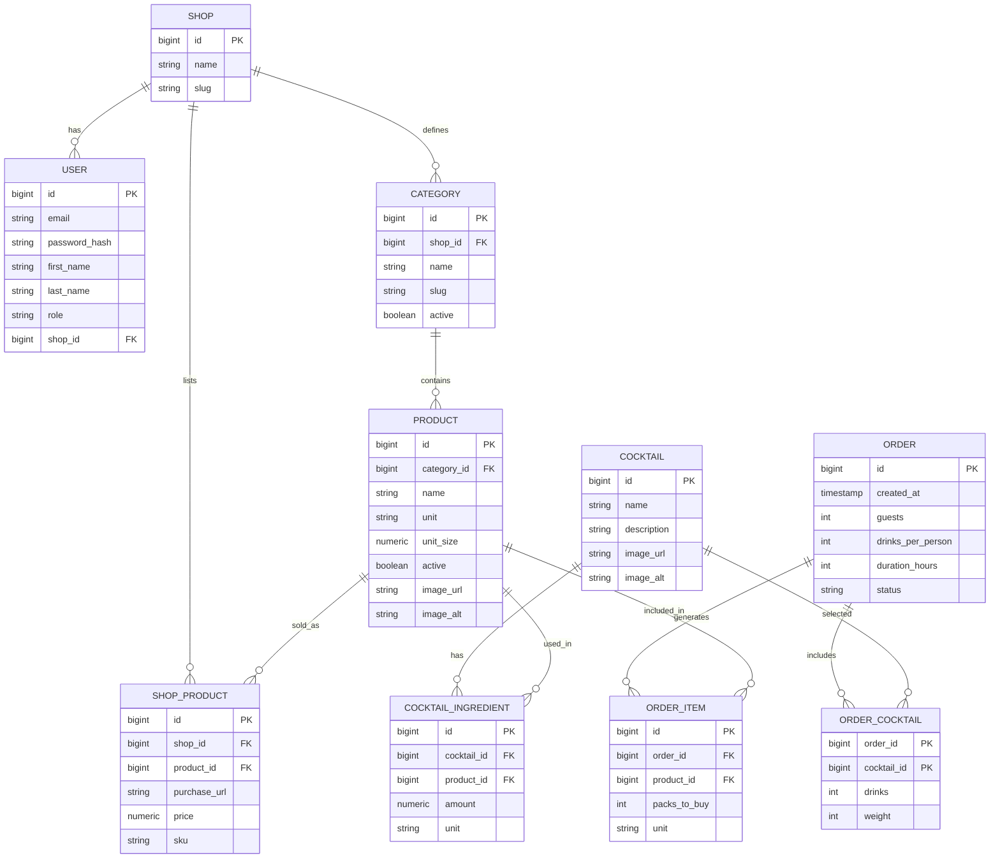
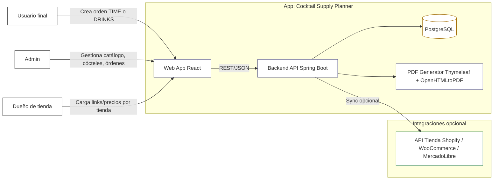

# CocktailOps
CocktailOps es una aplicación diseñada para facilitar la planificación y gestión de pedidos de cócteles para eventos. Permite a los usuarios seleccionar cócteles, calcular las cantidades necesarias de ingredientes y generar listas de compras detalladas y PDFs listos para imprimir.

## Índice
- [Características Principales](#características-principales)
- [Tecnologías Utilizadas](#tecnologías-utilizadas)
- [Diagramas](#diagramas)
  - [Diagrama de Entidad-Relación](#diagrama-de-entidad-relación)
  - [Diagrama de Arquitectura](#diagrama-de-arquitectura)
  - [Diagrama de Componentes](#diagrama-de-componentes)
- [Instalación y Uso](#instalación-y-uso)
  - [Requisitos Previos](#requisitos-previos)
  - [Pasos para Ejecutar la Aplicación](#pasos-para-ejecutar-la-aplicación)
  - [Creación de la Base de Datos](#creación-de-la-base-de-datos)
  - [Configuración de la Aplicación](#configuración-de-la-aplicación)
  - [Ejecutar la Aplicación](#ejecutar-la-aplicación)
- [API - Ejemplos y Postman](#api---ejemplos-y-postman)
- [Testing y CI](#testing-y-ci)
- [Notas y Recomendaciones](#notas-y-recomendaciones)


## Características Principales
- **Gestión de Productos**: Almacena información sobre productos, incluyendo nombre, categoría y unidades.
- **Gestión de Cócteles**: Permite la creación y almacenamiento de recetas de cócteles con sus ingredientes y cantidades.
- **Planificación de Pedidos**: Los usuarios pueden crear pedidos especificando el número de invitados, bebidas por persona, o el total de bebidas, y la duración del evento.
- **Generación de Listas de Compras**: Calcula automáticamente las cantidades necesarias de cada ingrediente, sugiere packs a comprar y genera PDFs con la lista de compra.

## Tecnologías Utilizadas
- Backend: Java 17+ con Spring Boot
- Base de Datos: PostgreSQL
- ORM: Hibernate / JPA
- Build: Maven
- Documentación: Markdown
- Diagramas: Mermaid
- Frontend: React (en desarrollo)
- Autenticación: JWT (en desarrollo)
- Pruebas: JUnit y Mockito (en desarrollo)


## Diagramas
Los diagramas Mermaid se mantienen íntegros en este README para facilitar la lectura técnica rápida.

### Diagrama de Entidad-Relación

```mermaid
erDiagram
  SHOP {
    bigint id PK
    string name
    string slug
  }

  USER {
    bigint id PK
    string email
    string password_hash
    string first_name
    string last_name
    string role
    bigint shop_id FK
  }

  CATEGORY {
    bigint id PK
    bigint shop_id FK
    string name
    string slug
    boolean active
  }

  PRODUCT {
    bigint id PK
    bigint category_id FK
    string name
    string unit
    numeric unit_size
    boolean active
    string image_url
    string image_alt
  }

  SHOP_PRODUCT {
    bigint id PK
    bigint shop_id FK
    bigint product_id FK
    string purchase_url
    numeric price
    string sku
  }

  COCKTAIL {
    bigint id PK
    string name
    string description
    string image_url
    string image_alt
  }

  COCKTAIL_INGREDIENT {
    bigint id PK
    bigint cocktail_id FK
    bigint product_id FK
    numeric amount
    string unit
  }

  ORDER {
    bigint id PK
    timestamp created_at
    int guests
    int drinks_per_person
    int duration_hours
    string status
  }

  ORDER_COCKTAIL {
    bigint order_id PK
    bigint cocktail_id PK
    int drinks
    int weight
  }

  ORDER_ITEM {
    bigint id PK
    bigint order_id FK
    bigint product_id FK
    int packs_to_buy
    string unit
  }

  SHOP ||--o{ USER : has
  SHOP ||--o{ CATEGORY : defines
  CATEGORY ||--o{ PRODUCT : contains

  SHOP ||--o{ SHOP_PRODUCT : lists
  PRODUCT ||--o{ SHOP_PRODUCT : sold_as

  COCKTAIL ||--o{ COCKTAIL_INGREDIENT : has
  PRODUCT  ||--o{ COCKTAIL_INGREDIENT : used_in

  ORDER   ||--o{ ORDER_COCKTAIL : includes
  COCKTAIL||--o{ ORDER_COCKTAIL : selected

  ORDER   ||--o{ ORDER_ITEM : generates
  PRODUCT ||--o{ ORDER_ITEM : included_in
```

### Diagrama de Arquitectura

```mermaid
flowchart LR

U[Usuario final]
A[Admin]
S[Dueño de tienda]

subgraph SYS[App: Cocktail Supply Planner]
  FE[Web App React]
  BE[Backend API Spring Boot]
  DB[(PostgreSQL)]
  PDF[PDF Generator Thymeleaf + OpenHTMLtoPDF]
end

subgraph EXT[Integraciones opcional]
  SHOPAPI[API Tienda Shopify / WooCommerce / MercadoLibre]
end

U -->|Crea orden TIME o DRINKS| FE
A -->|Gestiona catálogo, cócteles, órdenes| FE
S -->|Carga links/precios por tienda| FE

FE -->|REST/JSON| BE
BE --> DB
BE --> PDF
BE -->|Sync opcional| SHOPAPI

class U,A,S actor
class FE,BE,PDF box
class DB db
class SHOPAPI ext

classDef actor fill:#ffffff,stroke:#444,stroke-width:1px
classDef box fill:#ffffff,stroke:#5a5a8a,stroke-width:1px
classDef db fill:#ffffff,stroke:#a06a00,stroke-width:1px
classDef ext fill:#ffffff,stroke:#1f7a3a,stroke-width:1px
```

### Diagrama de Componentes

```mermaid
flowchart TB
subgraph API["API Layer"]
    C1["AuthController"]:::box
    C2["CatalogController<br/>(products + categories)"]:::box
    C3["CocktailController<br/>(cocktails + ingredients)"]:::box
    C4["OrderController<br/>(orders + pdf)"]:::box
    C5["ShopController<br/>(shops, shop_products)"]:::box
end

subgraph APP["Application/Service Layer"]
    S1["AuthService<br/>JWT + roles"]:::box
    S2["ProductService"]:::box
    S7["CategoryService"]:::box
    S3["CocktailService"]:::box
    S4["OrderService<br/>calcula packs + distribuye tragos"]:::box
    S5["PdfService<br/>genera PDF"]:::box
    S6["ShopService"]:::box
end

subgraph DOMAIN["Domain Model"]
    D7["Shop"]:::entity
    D6["User"]:::entity
    D9["Category"]:::entity
    D1["Product"]:::entity
    D8["ShopProduct"]:::entity

    D2["Cocktail"]:::entity
    D3["CocktailIngredient<br/>(amount + unit)"]:::entity

    D4["Order"]:::entity
    D10["OrderCocktail"]:::entity
    D5["OrderItem"]:::entity
end

subgraph INFRA["Infrastructure"]
    R1["Repositories (JPA)"]:::box
    FLY["Flyway Migrations"]:::box
    DB[("PostgreSQL")]:::db
end

%% Wiring
C1 --> S1
C2 --> S2
C2 --> S7
C3 --> S3
C4 --> S4
C4 --> S5
C5 --> S6

S1 --> R1
S2 --> R1
S7 --> R1
S3 --> R1
S4 --> R1
S6 --> R1

R1 --> DB
FLY --> DB

classDef box fill:#000000,stroke:#5a5a8a,stroke-width:1px;
classDef db fill:#000000,stroke:#a06a00,stroke-width:1px;
classDef entity fill:#000000,stroke:#1f7a3a,stroke-width:1px;
```


## Instalación y Uso

### Requisitos Previos
- Java 17 o superior
- Maven 3.6.3 o superior
- PostgreSQL 13 o superior
- (Opcional) Docker y Docker Compose

### Pasos para Ejecutar la Aplicación
1. Clona el repositorio:

```bash
git clone https://github.com/fran3103/CocktailOps.git
cd CocktailOps
```

2. Asegúrate de crear la base de datos (ver sección siguiente) y de tener las credenciales configuradas.

### Creación de la Base de Datos
Ejecuta en tu servidor PostgreSQL:

```sql
CREATE DATABASE cocktailops;
```

### Configuración de la Aplicación
Edita `src/main/resources/application-local.properties` (o usa variables de entorno). Ejemplo mínimo:

```properties
spring.profiles.active=local
server.port=8081

spring.datasource.url=jdbc:postgresql://localhost:5432/cocktailops
spring.datasource.username=postgres
spring.datasource.password=postgres
spring.datasource.driver-class-name=org.postgresql.Driver

spring.flyway.enabled=true
spring.flyway.locations=classpath:db/migration

spring.jpa.hibernate.ddl-auto=validate
```

Recomendación: no versionar credenciales; usar un archivo `application-local.properties` en `.gitignore` o variables de entorno.

### Ejecutar la Aplicación
Con PostgreSQL en ejecución:

```bash
mvn clean spring-boot:run -Dspring-boot.run.profiles=local
```

O empaqueta y ejecuta el jar:

```bash
mvn -DskipTests package
java -jar target/cocktailops-*.jar --spring.profiles.active=local
```

Swagger UI (si está habilitado):

```
http://localhost:8080/swagger-ui/index.html
```


## API - Ejemplos y Postman
A continuación se muestran los ejemplos principales usados en Postman (las capturas se encuentran en `docs/postman/`).

### 1) Crear Order (modo TIME — por invitados + duración)

**Body (JSON)**
```json
{
  "guests": 100,
  "durationHours": 5,
  "cocktails": [
    { "cocktailId": 1, "weight": 5 },
    { "cocktailId": 2, "weight": 4 }
  ]
}
```


### 2) Crear Order (modo DRINKS — por total de bebidas)

**Body (JSON)**
```json
{
  "totalDrinks": 100,
  "cocktails": [
    { "cocktailId": 1, "quantity": 25 },
    { "cocktailId": 12, "quantity": 25 },
    { "cocktailId": 13, "quantity": 25 },
    { "cocktailId": 5, "quantity": 25 }
  ]
}
```


### PDF
El servicio puede generar un PDF con la lista de compra y el detalle del pedido.


