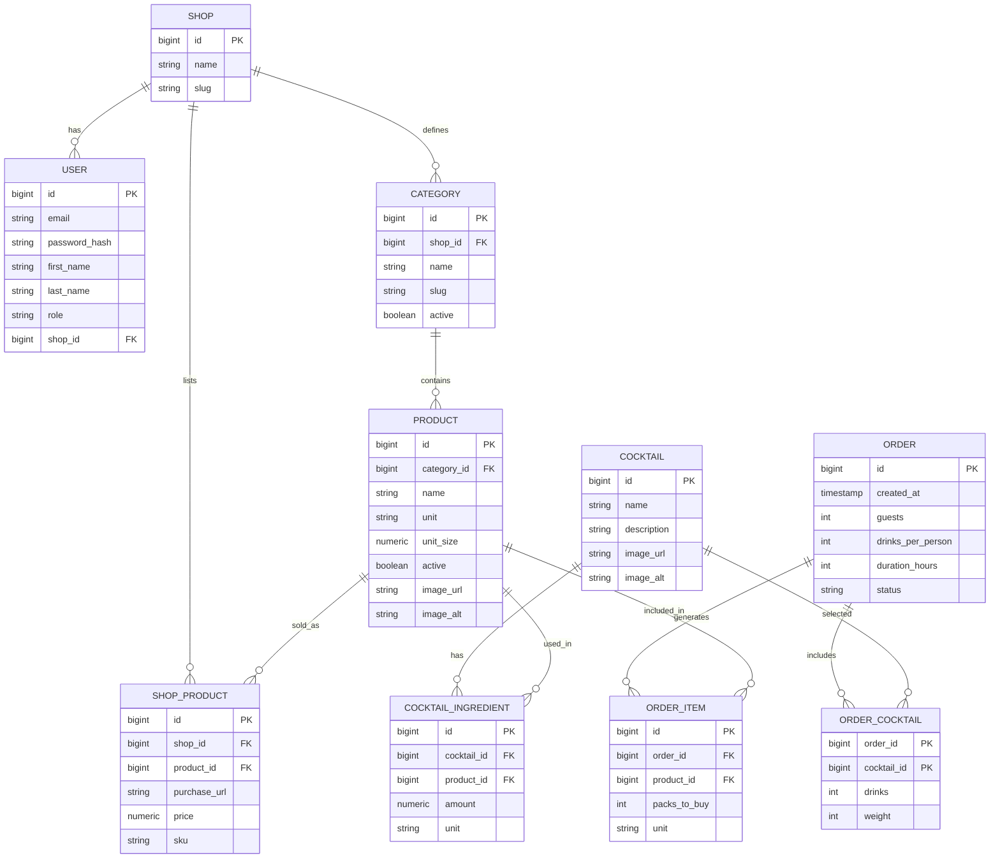

# CocktailOps  
CocktailOps es una aplicación diseñada para facilitar la planificación y gestión de pedidos de cócteles para eventos. Permite a los usuarios seleccionar cócteles, calcular las cantidades necesarias de ingredientes y generar listas de compras detalladas.

## Características Principales
- **Gestión de Productos**: Almacena información sobre productos, incluyendo nombre, categoría.
- **Gestión de Cócteles**: Permite la creación y almacenamiento de recetas de cócteles con sus ingredientes y cantidades.
- **Planificación de Pedidos**: Los usuarios pueden crear pedidos especificando el número de invitados, bebidas por persona y duración del evento.
- **Generación de Listas de Compras**: Calcula automáticamente las cantidades necesarias de cada ingrediente y genera una lista de compras.

## Tecnologías Utilizadas
- Backend: Java con Spring Boot
- Base de Datos: PostgreSQL
- ORM: Hibernate
- Control de Versiones: Git
- Documentación: Markdown
- Diagramas: Mermaid
- Frontend: React (en desarrollo)
- Autenticación: JWT (en desarrollo)
- Pruebas: JUnit y Mockito (en desarrollo)


## Diagrama de Entidad-Relación

```mermaid
erDiagram
  SHOP {
    bigint id PK
    string name
    string slug
  }

  USER {
    bigint id PK
    string email
    string password_hash
    string first_name
    string last_name
    string role
    bigint shop_id FK
  }

  CATEGORY {
    bigint id PK
    bigint shop_id FK
    string name
    string slug
    boolean active
  }

  PRODUCT {
    bigint id PK
    bigint category_id FK
    string name
    string unit
    numeric unit_size
    boolean active
    string image_url
    string image_alt
  }

  SHOP_PRODUCT {
    bigint id PK
    bigint shop_id FK
    bigint product_id FK
    string purchase_url
    numeric price
    string sku
  }

  COCKTAIL {
    bigint id PK
    string name
    string description
    string image_url
    string image_alt
  }

  COCKTAIL_INGREDIENT {
    bigint id PK
    bigint cocktail_id FK
    bigint product_id FK
    numeric amount
    string unit
  }

  ORDER {
    bigint id PK
    timestamp created_at
    int guests
    int drinks_per_person
    int duration_hours
    string status
  }

  ORDER_COCKTAIL {
    bigint order_id PK
    bigint cocktail_id PK
    int drinks
    int weight
  }

  ORDER_ITEM {
    bigint id PK
    bigint order_id FK
    bigint product_id FK
    int packs_to_buy
    string unit
  }

  SHOP ||--o{ USER : has
  SHOP ||--o{ CATEGORY : defines
  CATEGORY ||--o{ PRODUCT : contains

  SHOP ||--o{ SHOP_PRODUCT : lists
  PRODUCT ||--o{ SHOP_PRODUCT : sold_as

  COCKTAIL ||--o{ COCKTAIL_INGREDIENT : has
  PRODUCT  ||--o{ COCKTAIL_INGREDIENT : used_in

  ORDER   ||--o{ ORDER_COCKTAIL : includes
  COCKTAIL||--o{ ORDER_COCKTAIL : selected

  ORDER   ||--o{ ORDER_ITEM : generates
  PRODUCT ||--o{ ORDER_ITEM : included_in

```  

## Diagrama de Arquitectura
```mermaid
flowchart LR

U[Usuario final]
A[Admin]
S[Dueño de tienda]

subgraph SYS[App: Cocktail Supply Planner]
  FE[Web App (React)]
  BE[Backend API (Spring Boot)]
  DB[(PostgreSQL)]
  PDF[PDF Generator\nThymeleaf + OpenHTMLtoPDF]
end

subgraph EXT[Integraciones (opcional)]
  SHOPAPI[API Tienda\nShopify / WooCommerce / MercadoLibre]
end

U -->|Crea orden (TIME o DRINKS)| FE
A -->|Gestiona catálogo, cócteles, órdenes| FE
S -->|Carga links/precios por tienda| FE

FE -->|REST/JSON| BE
BE --> DB
BE --> PDF
BE -->|Sync opcional| SHOPAPI

class U,A,S actor
class FE,BE,PDF box
class DB db
class SHOPAPI ext

classDef actor fill:#000000,stroke:#444,stroke-width:1px;
classDef box fill:#000000,stroke:#5a5a8a,stroke-width:1px;
classDef db fill:#000000,stroke:#a06a00,stroke-width:1px;
classDef ext fill:#000000,stroke:#1f7a3a,stroke-width:1px;

```  


## Diagrama de Componentes


```mermaid
flowchart TB
subgraph API["API Layer"]
    C1["AuthController"]:::box
    C2["CatalogController<br/>(products + categories)"]:::box
    C3["CocktailController<br/>(cocktails + ingredients)"]:::box
    C4["OrderController<br/>(orders + pdf)"]:::box
    C5["ShopController<br/>(shops, shop_products)"]:::box
end

subgraph APP["Application/Service Layer"]
    S1["AuthService<br/>JWT + roles"]:::box
    S2["ProductService"]:::box
    S7["CategoryService"]:::box
    S3["CocktailService"]:::box
    S4["OrderService<br/>calcula packs + distribuye tragos"]:::box
    S5["PdfService<br/>genera PDF"]:::box
    S6["ShopService"]:::box
end

subgraph DOMAIN["Domain Model"]
    D7["Shop"]:::entity
    D6["User"]:::entity
    D9["Category"]:::entity
    D1["Product"]:::entity
    D8["ShopProduct"]:::entity

    D2["Cocktail"]:::entity
    D3["CocktailIngredient<br/>(amount + unit)"]:::entity

    D4["Order"]:::entity
    D10["OrderCocktail"]:::entity
    D5["OrderItem"]:::entity
end

subgraph INFRA["Infrastructure"]
    R1["Repositories (JPA)"]:::box
    FLY["Flyway Migrations"]:::box
    DB[("PostgreSQL")]:::db
end

%% Wiring
C1 --> S1
C2 --> S2
C2 --> S7
C3 --> S3
C4 --> S4
C4 --> S5
C5 --> S6

S1 --> R1
S2 --> R1
S7 --> R1
S3 --> R1
S4 --> R1
S6 --> R1

R1 --> DB
FLY --> DB

classDef box fill:#000000,stroke:#5a5a8a,stroke-width:1px;
classDef db fill:#000000,stroke:#a06a00,stroke-width:1px;
classDef entity fill:#000000,stroke:#1f7a3a,stroke-width:1px;
```  


## Instalación y Uso

### Requisitos Previos
- Java 17 o superior
- Maven 3.6.3 o superior
- PostgreSQL 13 o superior
- Spring Boot 4.0.2 o superior

### Pasos para Ejecutar la Aplicación
1. Clona el repositorio: `git clone https://github.com/fran3103/CocktailOps.git`
2. Navega al directorio del proyecto: `cd CocktailOps`

#### Creación de la Base de Datos
Antes de ejecutar la aplicación, crea una base de datos PostgreSQL para almacenar los datos de la aplicación. Puedes hacerlo ejecutando el siguiente comando SQL en tu servidor PostgreSQL:
```sql
CREATE DATABASE cocktailops;
```

### Configuración de la Aplicación
1. Abre el archivo `src/main/resources/application-local.properties`.

2. Actualiza las siguientes propiedades según tu configuración de base de datos:
```properties
   spring.profiles.active=local
   server.port=8080

spring.datasource.url=jdbc:postgresql://localhost:5432/cocktailops
spring.datasource.username=postgres
spring.datasource.password=postgres
spring.datasource.driver-class-name=org.postgresql.Driver

spring.flyway.enabled=true
spring.flyway.locations=classpath:db/migration

spring.jpa.hibernate.ddl-auto=validate
```


### Ejecutar la Aplicación
1. Asegúrate de tener PostgreSQL en ejecución.
2. Ejecuta:

```bash
mvn clean spring-boot:run -Dspring-boot.run.profiles=local

