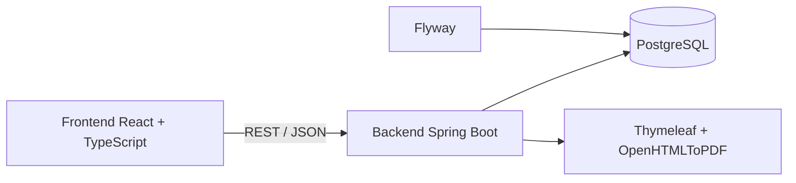
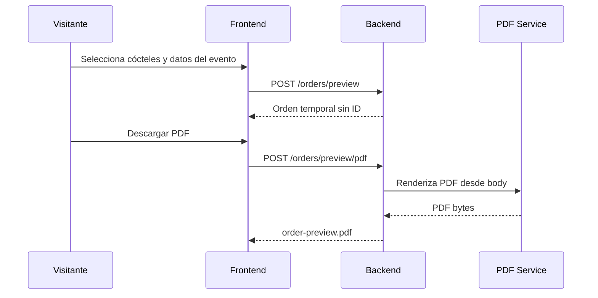
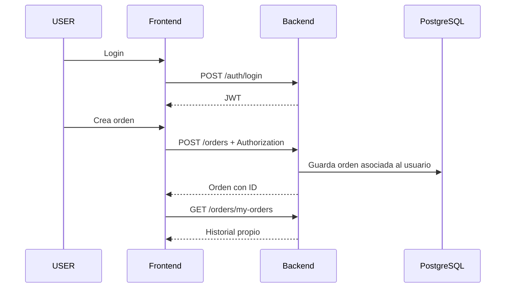

# CocktailOps Backend

Backend REST API de **CocktailOps**, desarrollado con **Java 17**, **Spring Boot**, **PostgreSQL** y **Flyway**.

Este módulo contiene la lógica principal del sistema: autenticación JWT, autorización por roles, catálogo de productos/cócteles, cálculo de órdenes, generación de PDF, historial de usuario, ownership de recursos y endpoints públicos de preview para visitantes.

---

## Índice

- [Descripción](#descripción)
- [Estado actual](#estado-actual)
- [Reglas principales del producto](#reglas-principales-del-producto)
- [Decisiones técnicas](#decisiones-técnicas)
- [Tecnologías utilizadas](#tecnologías-utilizadas)
- [Autenticación y seguridad](#autenticación-y-seguridad)
- [Cálculo de órdenes](#cálculo-de-órdenes)
- [PDF y lista de compra](#pdf-y-lista-de-compra)
- [Catálogo demo y migraciones](#catálogo-demo-y-migraciones)
- [Instalación y uso local](#instalación-y-uso-local)
- [API - Endpoints principales](#api---endpoints-principales)
- [Integración con frontend](#integración-con-frontend)
- [Testing](#testing)
- [Diagramas](#diagramas)
- [Próximos pasos](#próximos-pasos)
- [Autor](#autor)

---

## Descripción

CocktailOps Backend permite calcular insumos para eventos a partir de una selección de cócteles.

La API permite trabajar en dos modos:

```txt
TIME   → cálculo por invitados + duración del evento + preferencia/peso de cócteles
DRINKS → cálculo por cantidad total exacta de tragos + cantidad por cóctel
```

A partir de esos datos, el backend calcula:

- cantidad total de tragos
- distribución de tragos por cóctel
- ingredientes requeridos
- acumulación por producto
- packs, botellas o unidades sugeridas a comprar
- PDF con resumen del evento y lista de compra

El proyecto está pensado como una aplicación full stack de portfolio, mostrando un flujo completo entre frontend, backend, base de datos, seguridad, PDF, migraciones, Docker y CI.

---

## Estado actual

| Módulo | Estado |
|---|---|
| API Spring Boot | Implementado |
| PostgreSQL + Flyway | Implementado |
| Seed demo de catálogo | Implementado |
| Catálogo ampliado de cócteles | Implementado |
| Normalización de unidades | Implementado |
| Autenticación JWT | Implementado |
| Roles USER / ADMIN | Implementado |
| Endpoints públicos de catálogo | Implementado |
| Preview público de órdenes | Implementado |
| Creación persistente de órdenes autenticadas | Implementado |
| Historial de usuario | Implementado |
| Ownership sobre detalle y PDF | Implementado |
| PDF protegido por ID | Implementado |
| PDF preview desde body | Implementado |
| Dashboard frontend por rol soportado por API | Implementado |
| Tests unitarios backend | En progreso |
| GitHub Actions CI | Implementado |
| Deploy backend | Pendiente |

---

## Reglas principales del producto

### Invitado

Un visitante sin login puede:

- consultar productos
- consultar cócteles
- generar una orden temporal por modo `TIME`
- generar una orden temporal por modo `DRINKS`
- ver el resultado inmediato en frontend
- descargar un PDF de preview

Un visitante no puede:

- guardar órdenes en historial
- acceder a `/orders/my-orders`
- acceder a `/orders/{id}`
- descargar PDFs mediante `/orders/{id}/pdf`

Las órdenes de invitado son **temporales**:

```txt
No se persisten en base de datos.
No tienen ID real.
No quedan asociadas a usuario.
No aparecen en historial.
El PDF se genera desde el body enviado por el frontend.
```

### Usuario autenticado

Un usuario con rol `USER` puede:

- iniciar sesión
- crear órdenes reales y guardadas
- asociar órdenes a su cuenta
- consultar su historial
- ver detalle de sus órdenes
- descargar PDF por ID de sus propias órdenes

### Administrador

Un usuario con rol `ADMIN` puede:

- acceder a endpoints administrativos
- listar órdenes del sistema
- acceder al detalle de órdenes de cualquier usuario
- descargar PDFs de cualquier orden
- administrar catálogo mediante endpoints protegidos

---

## Decisiones técnicas

### Arquitectura por capas

El backend sigue una arquitectura por capas:

```txt
Controller → Service → Repository
```

Responsabilidades:

- **Controller**: expone endpoints HTTP, recibe requests, devuelve responses y documenta con Swagger.
- **Service**: contiene reglas de negocio, validaciones, cálculo de órdenes, ownership y generación de respuestas.
- **Repository**: accede a base de datos mediante Spring Data JPA.

Esta separación mejora la mantenibilidad, facilita el testing y evita mezclar reglas de negocio con detalles HTTP o persistencia.

### DTOs en lugar de entidades

La API trabaja con DTOs para requests y responses.

Motivos:

- evitar exponer entidades JPA directamente
- mantener estable el contrato de API
- validar inputs con Bean Validation
- controlar qué información se devuelve al frontend
- evitar problemas de serialización con relaciones lazy
- mejorar documentación Swagger/OpenAPI

Ejemplo:

```txt
GET /products devuelve categoryId y categoryName.
```

De esta forma el frontend puede mostrar la categoría del producto sin hacer una request adicional por cada producto.

### Preview separado de creación persistente

El backend separa claramente dos operaciones:

```txt
preview → calcula una orden pero no guarda
create  → calcula una orden y guarda en base
```

Esto evita que un visitante genere registros persistidos solo por probar el sistema.

Endpoints preview:

```http
POST /orders/preview
POST /orders/by-drinks/preview
POST /orders/preview/pdf
POST /orders/by-drinks/preview/pdf
```

Endpoints persistentes:

```http
POST /orders
POST /orders/by-drinks
```

Los endpoints persistentes requieren usuario autenticado.

### Ownership de recursos

El backend valida acceso a órdenes guardadas.

Regla:

```txt
ADMIN → puede acceder a cualquier orden
USER  → solo puede acceder a sus propias órdenes
```

Esto aplica especialmente a:

```http
GET /orders/{id}
GET /orders/{id}/pdf
```

### Flyway

Flyway versiona la base de datos con migraciones SQL.

Ventajas:

- base reproducible
- evolución controlada del esquema
- seed demo versionado
- trazabilidad de cambios
- integración simple con CI y entornos locales

### Manejo global de errores

El backend centraliza errores con `@RestControllerAdvice`.

Casos cubiertos:

- validaciones inválidas
- recursos no encontrados
- reglas de negocio incumplidas
- credenciales inválidas
- accesos prohibidos
- errores inesperados
- errores de generación de PDF

### Logging

Los servicios principales incluyen logs para seguir flujos importantes:

- creación de órdenes
- preview de órdenes
- búsqueda por ID
- generación de PDF
- errores esperados e inesperados

---

## Tecnologías utilizadas

- Java 17
- Spring Boot
- Maven
- PostgreSQL
- Spring Data JPA
- Hibernate
- Flyway
- Spring Security
- JWT
- Swagger / OpenAPI
- Thymeleaf
- OpenHTMLToPDF
- JUnit 5
- Mockito
- H2 para tests
- Docker Compose
- GitHub Actions CI
- Lombok

---

## Autenticación y seguridad

El backend utiliza **Spring Security + JWT**.

Flujo:

```txt
POST /auth/register
→ crea usuario USER
→ devuelve token JWT

POST /auth/login
→ valida credenciales
→ devuelve token JWT
```

Para requests protegidas:

```http
Authorization: Bearer <token>
```

### Reglas de acceso

| Endpoint | Acceso |
|---|---|
| `POST /auth/register` | Público |
| `POST /auth/login` | Público |
| Swagger / OpenAPI | Público |
| `GET /products` | Público |
| `GET /cocktails` | Público |
| `GET /categories` | Público |
| `POST /orders/preview` | Público |
| `POST /orders/by-drinks/preview` | Público |
| `POST /orders/preview/pdf` | Público |
| `POST /orders/by-drinks/preview/pdf` | Público |
| `POST /orders` | Usuario autenticado |
| `POST /orders/by-drinks` | Usuario autenticado |
| `GET /orders/my-orders` | Usuario autenticado |
| `GET /orders/{id}` | Dueño de la orden o ADMIN |
| `GET /orders/{id}/pdf` | Dueño de la orden o ADMIN |
| `GET /orders` | ADMIN |
| Escritura de catálogo | ADMIN |
| `/user/**` | ADMIN |
| `/shop/**` | ADMIN |

---

## Cálculo de órdenes

### Modo TIME

El modo `TIME` calcula la cantidad total de tragos a partir de:

```txt
invitados × duración × tragos por persona por hora
```

Ejemplo base:

```txt
60 invitados × 5 horas × 1 trago/persona/hora = 300 tragos
```

Además, el sistema aplica una estimación reforzada para eventos grandes con muchas opciones de cócteles:

```txt
Si invitados >= 60
y cócteles seleccionados >= 8
→ usa 2 tragos por persona por hora
```

Ejemplo:

```txt
60 invitados × 5 horas × 2 tragos/persona/hora = 600 tragos
```

Para eventos más chicos, aunque haya muchos cócteles, se mantiene la estimación conservadora:

```txt
40 invitados × 5 horas × 1 trago/persona/hora = 200 tragos
```

Esta regla evita inflar demasiado eventos pequeños y permite reforzar estimaciones para eventos grandes con mucha variedad.

### Pesos por cóctel

En modo `TIME`, cada cóctel puede recibir un `weight`.

El peso indica preferencia relativa:

```txt
Más peso → más tragos asignados a ese cóctel.
Menos peso → menos tragos asignados.
```

Ejemplo:

```txt
totalDrinks = 100

Mojito weight = 1
Daiquiri weight = 1
Gin Tonic weight = 2

Resultado:
Mojito    = 25
Daiquiri  = 25
Gin Tonic = 50
```

### Modo DRINKS

El modo `DRINKS` no estima por invitados ni duración.

El usuario indica:

- total exacto de tragos
- cantidad de tragos por cóctel

Regla:

```txt
La suma de cantidades por cóctel debe ser igual a totalDrinks.
```

Ejemplo:

```json
{
  "totalDrinks": 100,
  "cocktails": [
    { "cocktailId": 1, "quantity": 25 },
    { "cocktailId": 2, "quantity": 25 },
    { "cocktailId": 3, "quantity": 25 },
    { "cocktailId": 4, "quantity": 25 }
  ]
}
```

### Acumulación de ingredientes

El sistema no calcula botellas por cóctel de forma separada.

Primero acumula los ingredientes por producto y luego calcula la compra sugerida.

Ejemplo:

```txt
Mojito usa Ron
Daiquiri usa Ron

El sistema suma todo el ron requerido.
Después calcula cuántas botellas comprar.
```

Esto evita duplicar productos y genera una lista de compra más realista.

### Unidades soportadas

El sistema soporta y normaliza unidades de producto:

```txt
ML
GR
UNID
```

También acepta variantes en datos heredados/locales, como:

```txt
ml / ML
g / G / gr / GR
unid / UNID / unit / UNIT
```

Las recetas pueden usar onzas (`OZ`) y el backend convierte a la unidad del producto cuando corresponde:

```txt
OZ → ML
OZ → GR
```

No se hacen conversiones ambiguas como:

```txt
UNID → GR
UNID → ML
```

Cuando un producto se compra en gramos, la receta también debe estar expresada en gramos.

---

## PDF y lista de compra

El backend genera PDFs con **Thymeleaf + OpenHTMLToPDF**.

Tipos de PDF:

| Caso | Endpoint |
|---|---|
| Orden guardada | `GET /orders/{id}/pdf` |
| Preview TIME | `POST /orders/preview/pdf` |
| Preview DRINKS | `POST /orders/by-drinks/preview/pdf` |

### PDF protegido por ID

```http
GET /orders/{id}/pdf
Authorization: Bearer <token>
```

Reglas:

```txt
USER  → solo PDF de órdenes propias
ADMIN → cualquier PDF
```

### PDF preview público

```http
POST /orders/preview/pdf
POST /orders/by-drinks/preview/pdf
```

Estos endpoints reciben el body de la orden y devuelven un PDF sin acceder a una orden persistida.

Esto permite que un visitante descargue una lista de compra sin registrarse.

### Interpretación de la compra sugerida

La lista de compra no representa una compra “exacta” sin sobrantes.

Representa la cantidad mínima de packs, botellas o unidades necesarias para poder preparar hasta la cantidad total de tragos estimada.

Ejemplo:

```txt
Ron requerido: 1600 ML
Botella: 750 ML

1600 / 750 = 2.13
Resultado: comprar 3 botellas
```

Por eso el PDF incluye una aclaración:

```txt
Las cantidades sugeridas están calculadas para poder preparar hasta la cantidad total de tragos estimada.
Los productos se redondean hacia arriba según su formato de compra, por ejemplo botellas, packs o unidades, por lo que puede sobrar producto al finalizar el evento.
```

### Fecha del PDF

Para órdenes temporales y guardadas, el backend asigna fecha de creación y el PDF la muestra en formato:

```txt
dd/MM/yyyy
```

Ejemplo:

```txt
21/08/2026
```

---

## Catálogo demo y migraciones

El catálogo demo se carga mediante Flyway.

Incluye:

- categorías
- productos base
- productos adicionales
- cócteles clásicos
- cócteles modernos
- ingredientes por cóctel
- normalización de unidades

Migraciones destacadas:

| Migración | Descripción |
|---|---|
| `V1__initial_schema.sql` | Esquema inicial |
| `V6__add_user_id_to_orders.sql` | Asociación Order → User |
| `V7__seed_demo_catalog_data.sql` | Catálogo demo inicial |
| `V8__add_more_demo_cocktails.sql` | Ampliación del catálogo de cócteles |
| `V9__fix_sugar_ingredient_units.sql` | Corrección de azúcar en recetas |
| `V10__normalize_demo_catalog_units.sql` | Normalización de unidades y catálogo demo |

### Cócteles demo

El catálogo demo incluye aproximadamente 30 cócteles, entre ellos:

- Mojito
- Daiquiri
- Gin Tonic
- Margarita
- Fernet Cola
- Aperol Spritz
- Cuba Libre
- Negroni
- Old Fashioned
- Whisky Sour
- Tom Collins
- Dry Martini
- Cosmopolitan
- Moscow Mule
- Paloma
- Caipirinha
- Caipiroska
- Piña Colada
- Sex on the Beach
- Espresso Martini
- Tequila Sunrise
- Americano
- Garibaldi
- French 75
- Bellini
- Vodka Tonic
- Campari Tonic
- Gin Fizz
- Vodka Collins
- Caipirissima

Este catálogo permite que el frontend ofrezca búsqueda manual y listas rápidas predefinidas.

---

## Instalación y uso local

### Requisitos

- Java 17
- Maven
- Docker Desktop
- Docker Compose
- PostgreSQL local solo si no se usa Docker

### Clonar repositorio

```bash
git clone https://github.com/Fran3103/CocktailOps.git
cd CocktailOps
```

### Levantar PostgreSQL con Docker Compose

El `docker-compose.yml` está en la raíz del proyecto.

```bash
docker compose up -d
```

El contenedor expone PostgreSQL localmente en:

```txt
localhost:5434
```

Verificar contenedor:

```bash
docker compose ps
```

### Configuración local

Crear el archivo:

```txt
backend/src/main/resources/application-local.properties
```

Tomar como base:

```txt
backend/src/main/resources/application-local.example.properties
```

Ejemplo recomendado para Docker local:

```properties
server.port=8081

spring.datasource.url=jdbc:postgresql://127.0.0.1:5434/cocktailOps_db?sslmode=disable
spring.datasource.username=postgres
spring.datasource.password=admin
spring.datasource.driver-class-name=org.postgresql.Driver

spring.flyway.enabled=true
spring.flyway.locations=classpath:db/migration

spring.jpa.hibernate.ddl-auto=validate
spring.jpa.properties.hibernate.jdbc.time_zone=UTC

spring.jackson.time-zone=UTC

order.drinksPerPersonPerHour=1

security.jwt.secret=local-dev-secret-key-32-characters-minimum-change-me-123456

springdoc.swagger-ui.path=/swagger-ui.html
springdoc.api-docs.path=/v3/api-docs
```

> `application-local.properties` no debe versionarse porque puede contener credenciales locales.

### Ejecutar backend

Desde `backend/`:

```bash
mvn spring-boot:run "-Dspring-boot.run.profiles=local"
```

O desde la raíz:

```bash
mvn -f backend/pom.xml spring-boot:run "-Dspring-boot.run.profiles=local"
```

### Ejecutar tests y build

Desde `backend/`:

```bash
mvn clean install
```

Desde la raíz:

```bash
mvn -f backend/pom.xml clean install
```

### Swagger UI

Con la aplicación corriendo:

```txt
http://localhost:8081/swagger-ui/index.html
```

### Apagar PostgreSQL

```bash
docker compose down
```

Para borrar también el volumen:

```bash
docker compose down -v
```

> Usar `docker compose down -v` solo si se quiere reconstruir completamente la base local.

---

## API - Endpoints principales

### Auth

#### Registro

```http
POST /auth/register
```

Body:

```json
{
  "email": "usuario@ejemplo.com",
  "password": "123456",
  "firstName": "Juan",
  "lastName": "Pérez"
}
```

#### Login

```http
POST /auth/login
```

Body:

```json
{
  "email": "usuario@ejemplo.com",
  "password": "123456"
}
```

Respuesta esperada:

```json
{
  "id": 1,
  "email": "usuario@ejemplo.com",
  "firstName": "Juan",
  "lastName": "Pérez",
  "role": "USER",
  "token": "eyJhbGciOiJIUzI1NiJ9..."
}
```

### Catálogo

#### Listar productos

```http
GET /products
```

Respuesta simplificada:

```json
[
  {
    "productId": 1,
    "name": "Gin",
    "unit": "ML",
    "unitSize": 750.00,
    "active": true,
    "imageUrl": null,
    "imageAlt": "Botella de gin",
    "categoryId": 1,
    "categoryName": "Alcoholes"
  }
]
```

#### Listar cócteles

```http
GET /cocktails
```

#### Listar categorías

```http
GET /categories
```

Las operaciones de escritura del catálogo requieren rol `ADMIN`.

### Preview de orden TIME

```http
POST /orders/preview
```

Body:

```json
{
  "guests": 60,
  "durationHours": 5,
  "cocktails": [
    { "cocktailId": 1, "weight": 3 },
    { "cocktailId": 2, "weight": 2 },
    { "cocktailId": 3, "weight": 1 }
  ]
}
```

Características:

```txt
Público.
No guarda en base.
No devuelve ID persistente.
Sirve para invitado.
```

### Crear orden TIME guardada

```http
POST /orders
Authorization: Bearer <token>
```

Body:

```json
{
  "guests": 60,
  "durationHours": 5,
  "cocktails": [
    { "cocktailId": 1, "weight": 3 },
    { "cocktailId": 2, "weight": 2 },
    { "cocktailId": 3, "weight": 1 }
  ]
}
```

Características:

```txt
Requiere usuario autenticado.
Guarda en base.
Asocia la orden al usuario.
Aparece en historial.
Permite detalle y PDF por ID.
```

### Preview de orden DRINKS

```http
POST /orders/by-drinks/preview
```

Body:

```json
{
  "totalDrinks": 100,
  "cocktails": [
    { "cocktailId": 1, "quantity": 25 },
    { "cocktailId": 2, "quantity": 25 },
    { "cocktailId": 3, "quantity": 25 },
    { "cocktailId": 4, "quantity": 25 }
  ]
}
```

Características:

```txt
Público.
No guarda en base.
La suma de quantity debe ser igual a totalDrinks.
```

### Crear orden DRINKS guardada

```http
POST /orders/by-drinks
Authorization: Bearer <token>
```

Body:

```json
{
  "totalDrinks": 100,
  "cocktails": [
    { "cocktailId": 1, "quantity": 25 },
    { "cocktailId": 2, "quantity": 25 },
    { "cocktailId": 3, "quantity": 25 },
    { "cocktailId": 4, "quantity": 25 }
  ]
}
```

### Historial propio

```http
GET /orders/my-orders
Authorization: Bearer <token>
```

Devuelve únicamente órdenes asociadas al usuario autenticado.

### Detalle de orden

```http
GET /orders/{id}
Authorization: Bearer <token>
```

Reglas:

```txt
USER  → solo órdenes propias
ADMIN → cualquier orden
```

### Listado administrativo de órdenes

```http
GET /orders
Authorization: Bearer <token-admin>
```

Devuelve las órdenes del sistema para el dashboard administrativo.

### PDF de orden guardada

```http
GET /orders/{id}/pdf
Authorization: Bearer <token>
```

Reglas:

```txt
USER  → solo PDF de órdenes propias
ADMIN → cualquier PDF
```

### PDF preview TIME

```http
POST /orders/preview/pdf
```

Devuelve:

```txt
Content-Type: application/pdf
filename: order-preview.pdf
```

### PDF preview DRINKS

```http
POST /orders/by-drinks/preview/pdf
```

Devuelve:

```txt
Content-Type: application/pdf
filename: order-preview.pdf
```

---

## Integración con frontend

El frontend consume este backend mediante Axios y una variable de entorno:

```env
VITE_API_BASE_URL=http://localhost:8081
```

Funcionalidades actualmente soportadas desde frontend:

- login
- registro
- persistencia de sesión en `localStorage`
- catálogo de productos
- catálogo de cócteles
- creación de orden temporal para invitado
- creación de orden guardada para usuario autenticado
- preview JSON para invitado
- preview PDF para invitado
- PDF por ID para orden guardada
- historial de usuario
- detalle de orden protegida
- dashboard por tipo de usuario
- dashboard administrativo con órdenes del sistema
- listas rápidas de cócteles

### Listas rápidas del frontend

El frontend incluye presets de cócteles por caso de uso:

- Clásicos simples
- Clásicos completos
- Boda / evento elegante
- Modernos y fiesta
- Verano / tropical
- Aperitivos
- Premium clásico
- Popular y rápido

Los presets seleccionan cócteles por nombre y asignan pesos iniciales.

Después el usuario puede ajustar manualmente:

```txt
Modo TIME   → pesos/preferencias
Modo DRINKS → cantidades por cóctel
```

### Explicación visual de cálculo

El frontend muestra aclaraciones para que el usuario entienda:

- cuándo una orden es temporal
- cuándo se guarda en historial
- qué significa el peso de un cóctel
- qué significa la estimación de tragos
- que la lista de compra se redondea por botella, pack o unidad

---

## Testing

El backend incorpora tests con JUnit 5 y Mockito.

Estado actual:

| Área | Estado |
|---|---|
| ProductServiceImpl | Cobertura básica implementada |
| OrderServiceImpl | Cobertura parcial |
| Auth/Security | Pendiente de ampliar |
| PDF preview | Pendiente de ampliar |
| Ownership | Pendiente de ampliar |
| Controller tests | Pendiente |

Tests recomendados próximos:

- `previewOrder` no persiste
- `previewOrderByDrinks` no persiste
- `createOrder` persiste y asocia usuario
- `createOrderByDrinks` persiste y asocia usuario
- `getOrderById` permite dueño
- `getOrderById` permite admin
- `getOrderById` rechaza usuario no dueño
- `generateOrderPreviewPdf` genera PDF sin ID
- `generateOrderPdf` respeta ownership

---

## Diagramas

### Arquitectura general



### Flujo de invitado



### Flujo de usuario autenticado



---

## Próximos pasos

### Antes de deploy

- Revisar variables de entorno productivas
- Preparar `application-prod.properties`
- Ajustar CORS para URL real del frontend
- Verificar que no haya secretos en repositorio
- Probar flujo completo local:
  - invitado
  - USER
  - ADMIN
  - PDF preview
  - PDF por ID
- Actualizar README raíz si corresponde
- Preparar capturas para portfolio

### Mejoras backend futuras

- Rate limiting básico para endpoints públicos de preview
- Verificación de email
- Reset de contraseña
- Más tests de seguridad y ownership
- Más tests de PDF
- Dockerfile para backend
- Deploy del backend
- Panel administrativo real para catálogo
- Auditoría de órdenes
- Mejoras Swagger en endpoints nuevos
- Postman collection del flujo completo

---

## Autor

Proyecto desarrollado por **Franco Aguirre** como parte de su portfolio profesional full stack.

Stack trabajado:

- Java
- Spring Boot
- PostgreSQL
- Flyway
- Spring Security
- JWT
- React
- TypeScript
- Testing
- QA Manual
