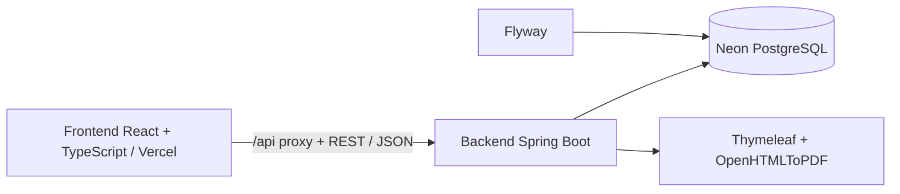
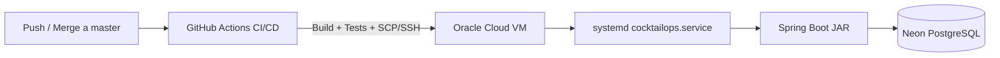
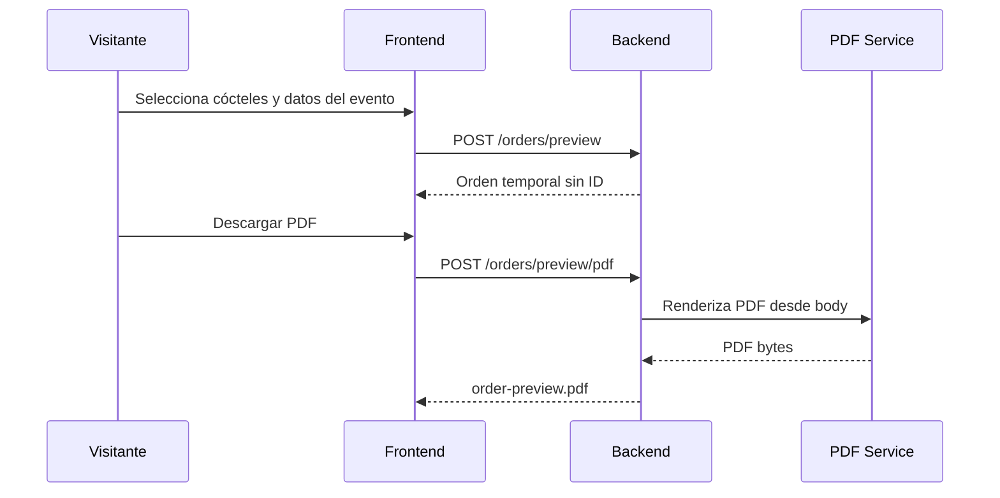
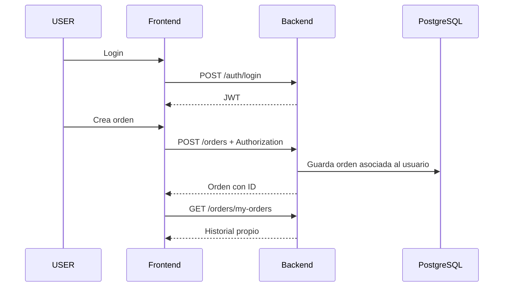

# CocktailOps Backend

Backend REST API de **CocktailOps**, desarrollado con **Java 17**, **Spring Boot 4.0.2**, **PostgreSQL** y **Flyway**.

Este módulo contiene la lógica principal del sistema: autenticación JWT, autorización por roles, catálogo de productos/cócteles, cálculo de órdenes, prioridades de consumo, productos preparados, generación de PDF, historial de usuario, ownership de recursos y endpoints públicos de preview para visitantes.

---

## Índice

- [Descripción](#descripción)
- [Estado actual](#estado-actual)
- [Reglas principales del producto](#reglas-principales-del-producto)
- [Decisiones técnicas](#decisiones-técnicas)
- [Tecnologías utilizadas](#tecnologías-utilizadas)
- [Autenticación y seguridad](#autenticación-y-seguridad)
- [Cálculo de órdenes](#cálculo-de-órdenes)
- [PDF y lista de compra](#pdf-y-lista-de-compra)
- [Catálogo demo y migraciones](#catálogo-demo-y-migraciones)
- [Instalación y uso local](#instalación-y-uso-local)
- [API - Endpoints principales](#api---endpoints-principales)
- [Integración con frontend](#integración-con-frontend)
- [Testing](#testing)
- [Deploy e infraestructura](#deploy-e-infraestructura)
- [Diagramas](#diagramas)
- [Próximos pasos](#próximos-pasos)
- [Autor](#autor)

---

## Descripción

CocktailOps Backend permite calcular insumos para eventos a partir de una selección de cócteles.

La API permite trabajar en dos modos:

```txt
TIME   → cálculo por invitados + duración del evento + preferencia/peso de cócteles
DRINKS → cálculo por cantidad total exacta de tragos + cantidad por cóctel
```

A partir de esos datos, el backend calcula:

- cantidad total de tragos
- distribución de tragos por cóctel
- ingredientes requeridos
- acumulación por producto
- packs, botellas o unidades sugeridas a comprar
- PDF con resumen del evento y lista de compra

El proyecto está pensado como una aplicación full stack de portfolio, mostrando un flujo completo entre frontend, backend, base de datos, seguridad, PDF, migraciones, Docker, testing, CI/CD y despliegue cloud.

---

## Estado actual

| Módulo | Estado |
|---|---|
| API Spring Boot | Implementado |
| PostgreSQL + Flyway | Implementado |
| Seed demo de catálogo | Implementado |
| Catálogo ampliado de productos y cócteles | Implementado |
| Descripción de productos | Implementado |
| Tipo de preparación de cócteles | Implementado |
| Normalización de unidades | Implementado |
| Autenticación JWT | Implementado |
| Roles `USER` / `ADMIN` | Implementado |
| Endpoints públicos de catálogo | Implementado |
| Preview público de órdenes | Implementado |
| Creación persistente de órdenes autenticadas | Implementado |
| Historial de usuario | Implementado |
| Ownership sobre detalle y PDF | Implementado |
| PDF protegido por ID | Implementado |
| PDF preview desde body | Implementado |
| Prioridades `1..4` en modo `TIME` | Implementado |
| Distribución exacta por pesos | Implementado |
| Productos preparados / subrecetas | Implementado |
| Almíbar simple convertido a azúcar | Implementado |
| Hielo global por cantidad de tragos | Implementado |
| Límite de órdenes persistidas por usuario | Implementado |
| Tests unitarios backend | **40 tests en verde** |
| GitHub Actions CI/CD | Implementado |
| PostgreSQL en Neon | Implementado |
| Deploy backend en Oracle Cloud | Implementado |
| Servicio `systemd` | Implementado |
| Health check de deploy | Implementado |
| Backup y rollback automático de JAR | Implementado |
| Frontend en Vercel | Implementado |
| Proxy `/api` Vercel → Oracle | Implementado |
| CRUD backend de `Shop` | Implementado, fuera del flujo principal |
| Integración Order → Shop / carrito | No implementado |
| Panel visual completo de administración de catálogo | No implementado |

El backend se considera **funcionalmente cerrado para la versión portfolio**. Las funcionalidades no implementadas se mantienen como evolución futura y no forman parte del flujo principal presentado al usuario.

## Reglas principales del producto

### Invitado

Un visitante sin login puede:

- consultar productos
- consultar cócteles
- generar una orden temporal por modo `TIME`
- generar una orden temporal por modo `DRINKS`
- ver el resultado inmediato en frontend
- descargar un PDF de preview

Un visitante no puede:

- guardar órdenes en historial
- acceder a `/orders/my-orders`
- acceder a `/orders/{id}`
- descargar PDFs mediante `/orders/{id}/pdf`

Las órdenes de invitado son **temporales**:

```txt
No se persisten en base de datos.
No tienen ID real.
No quedan asociadas a usuario.
No aparecen en historial.
El PDF se genera desde el body enviado por el frontend.
```

### Usuario autenticado

Un usuario con rol `USER` puede:

- iniciar sesión
- crear órdenes reales y guardadas
- asociar órdenes a su cuenta
- consultar su historial
- ver detalle de sus órdenes
- descargar PDF por ID de sus propias órdenes

Para proteger la demo pública y limitar el crecimiento innecesario de la base, cada usuario autenticado puede guardar como máximo **25 órdenes dentro de una ventana móvil de 24 horas**.

```txt
Máximo: 25 órdenes persistidas por usuario / 24 h
Al alcanzar el límite: HTTP 429 Too Many Requests
```

El límite se aplica únicamente a las órdenes persistentes. Los previews temporales no cuentan porque no se guardan en base de datos.

### Administrador

Un usuario con rol `ADMIN` puede:

- acceder a endpoints administrativos
- listar órdenes del sistema
- acceder al detalle de órdenes de cualquier usuario
- descargar PDFs de cualquier orden
- administrar catálogo mediante endpoints protegidos

> El backend ya protege operaciones de catálogo para `ADMIN`, pero la versión actual del frontend no implementa un panel completo de alta/edición de productos y cócteles. En la interfaz actual la diferencia principal del administrador es el acceso al historial global de órdenes.

---

## Decisiones técnicas

### Arquitectura por capas

El backend sigue una arquitectura por capas:

```txt
Controller → Service → Repository
```

Responsabilidades:

- **Controller**: expone endpoints HTTP, recibe requests, devuelve responses y documenta con Swagger.
- **Service**: contiene reglas de negocio, validaciones, cálculo de órdenes, ownership y generación de respuestas.
- **Repository**: accede a base de datos mediante Spring Data JPA.

Esta separación mejora la mantenibilidad, facilita el testing y evita mezclar reglas de negocio con detalles HTTP o persistencia.

### DTOs en lugar de entidades

La API trabaja con DTOs para requests y responses.

Motivos:

- evitar exponer entidades JPA directamente
- mantener estable el contrato de API
- validar inputs con Bean Validation
- controlar qué información se devuelve al frontend
- evitar problemas de serialización con relaciones lazy
- mejorar documentación Swagger/OpenAPI

Ejemplo:

```txt
GET /products devuelve categoryId y categoryName.
```

De esta forma el frontend puede mostrar la categoría del producto sin hacer una request adicional por cada producto.

### Preview separado de creación persistente

El backend separa claramente dos operaciones:

```txt
preview → calcula una orden pero no guarda
create  → calcula una orden y guarda en base
```

Esto evita que un visitante genere registros persistidos solo por probar el sistema.

Endpoints preview:

```http
POST /orders/preview
POST /orders/by-drinks/preview
POST /orders/preview/pdf
POST /orders/by-drinks/preview/pdf
```

Endpoints persistentes:

```http
POST /orders
POST /orders/by-drinks
```

Los endpoints persistentes requieren usuario autenticado.

### Ownership de recursos

El backend valida acceso a órdenes guardadas.

Regla:

```txt
ADMIN → puede acceder a cualquier orden
USER  → solo puede acceder a sus propias órdenes
```

Esto aplica especialmente a:

```http
GET /orders/{id}
GET /orders/{id}/pdf
```

### Límite de órdenes persistidas

La API limita la cantidad de órdenes que puede persistir un usuario autenticado:

```txt
25 órdenes guardadas como máximo dentro de las últimas 24 horas.
```

La validación se realiza antes de persistir una nueva orden, consultando cuántas órdenes creó el usuario desde `Instant.now() - 24 h`.

Si el límite fue alcanzado, el backend responde:

```http
429 Too Many Requests
```

Esta regla protege la base de datos y los recursos de la demo sin impedir que un visitante utilice los endpoints de preview.

### Flyway

Flyway versiona la base de datos con migraciones SQL.

Ventajas:

- base reproducible
- evolución controlada del esquema
- seed demo versionado
- trazabilidad de cambios
- integración simple con CI y entornos locales

### Manejo global de errores

El backend centraliza errores con `@RestControllerAdvice`.

Casos cubiertos:

- validaciones inválidas
- recursos no encontrados
- reglas de negocio incumplidas
- credenciales inválidas
- accesos prohibidos
- límite de uso alcanzado (`429 Too Many Requests`)
- errores inesperados
- errores de generación de PDF

### Logging

Los servicios principales incluyen logs para seguir flujos importantes:

- creación de órdenes
- preview de órdenes
- búsqueda por ID
- generación de PDF
- errores esperados e inesperados

---

## Tecnologías utilizadas

- Java 17
- Spring Boot 4.0.2
- Maven
- PostgreSQL
- Spring Data JPA
- Hibernate
- Flyway
- Spring Security
- JWT
- Swagger / OpenAPI
- Thymeleaf
- OpenHTMLToPDF
- JUnit 5
- Mockito
- H2 para tests
- Docker Compose
- GitHub Actions CI/CD
- Oracle Cloud Infrastructure
- Ubuntu 24.04
- systemd
- Neon PostgreSQL
- SSH / SCP para despliegue
- Lombok

---

## Autenticación y seguridad

El backend utiliza **Spring Security + JWT**.

Flujo:

```txt
POST /auth/register
→ crea usuario USER
→ devuelve token JWT

POST /auth/login
→ valida credenciales
→ devuelve token JWT
```

Para requests protegidas:

```http
Authorization: Bearer <token>
```

### Reglas de acceso

| Endpoint | Acceso |
|---|---|
| `POST /auth/register` | Público |
| `POST /auth/login` | Público |
| Swagger / OpenAPI | Público |
| `GET /products` | Público |
| `GET /cocktails` | Público |
| `GET /categories` | Público |
| `POST /orders/preview` | Público |
| `POST /orders/by-drinks/preview` | Público |
| `POST /orders/preview/pdf` | Público |
| `POST /orders/by-drinks/preview/pdf` | Público |
| `POST /orders` | Usuario autenticado |
| `POST /orders/by-drinks` | Usuario autenticado |
| `GET /orders/my-orders` | Usuario autenticado |
| `GET /orders/{id}` | Dueño de la orden o ADMIN |
| `GET /orders/{id}/pdf` | Dueño de la orden o ADMIN |
| `GET /orders` | ADMIN |
| Escritura de catálogo | ADMIN |
| `/user/**` | ADMIN |
| `/shop/**` | ADMIN |

### Protección de creación persistente

Los endpoints que guardan órdenes requieren autenticación y respetan el límite de uso por usuario:

```txt
POST /orders
POST /orders/by-drinks

→ máximo 25 órdenes persistidas por usuario dentro de 24 horas
→ exceso de límite: 429 Too Many Requests
```

Los endpoints públicos de preview permanecen separados y no generan registros persistidos.

---

## Cálculo de órdenes

### Modo TIME

El modo `TIME` calcula el total a partir de:

```txt
invitados × duración × tragos por persona por hora
```

La estimación base actual es `1 trago por persona por hora` y puede configurarse con:

```properties
order.drinksPerPersonPerHour=1
```

Ejemplo:

```txt
290 invitados × 6 horas × 1 = 1740 tragos
```

La versión actual **no duplica automáticamente el consumo en eventos grandes**.

### Prioridad / peso de cócteles

En modo `TIME`, cada cóctel puede recibir una prioridad:

| Prioridad visible | `weight` |
|---|---:|
| Baja | `1` |
| Normal | `2` |
| Media | `3` |
| Alta | `4` |

Reglas:

```txt
mínimo = 1
máximo = 4
default = 2 (Normal)
```

El peso es relativo: a mayor peso, mayor proporción del total de tragos.

### Distribución exacta

Cuando la distribución proporcional genera decimales, el backend utiliza un esquema de **largest remainder**: asigna la parte entera y reparte los tragos faltantes según los mayores restos decimales.

Esto garantiza:

```txt
suma de tragos distribuidos == totalDrinks
```

### Modo DRINKS

El modo `DRINKS` no estima por invitados ni duración. El usuario indica el total exacto de tragos y la cantidad exacta por cóctel.

```txt
sum(quantity) == totalDrinks
```

Los modos `TIME` y `DRINKS` comparten el mismo motor de recetas, unidades, productos preparados, packs e hielo.

### Acumulación de ingredientes

CocktailOps no calcula botellas por cóctel de manera separada. Primero suma el total requerido de cada producto y después calcula el formato de compra.

```txt
Mojito usa Ron
Daiquiri usa Ron

→ sumar todo el Ron requerido
→ dividir por el tamaño de botella
→ redondear hacia arriba una sola vez
```

### Unidades soportadas

Unidades principales: `ML`, `GR`, `UNID`. Las recetas también pueden utilizar `OZ`.

```txt
OZ → ML  (1 oz = 29.5735 ml)
OZ → GR  (1 oz = 28.3495 g)
```

No se realizan conversiones ambiguas como `UNID → ML` o `UNID → GR`.

### Productos preparados

El modelo de producto incluye `purchasable`.

- `true`: el producto puede aparecer directamente en la lista de compra.
- `false`: el backend busca una subreceta y reemplaza el producto por sus materias primas **antes de calcular packs**.

Primer caso implementado:

```txt
Almíbar simple
1000 g de azúcar + agua ≈ 1600 ml de almíbar terminado
```

El agua no se incluye como producto de compra. El almíbar se convierte en azúcar, esa azúcar se acumula con cualquier azúcar directa y recién después se redondean los packs.

La expansión es recursiva y valida producto preparado sin receta, `outputAmount`, unidades y ciclos entre subrecetas.

### Cálculo de packs

```txt
packsToBuy = ceil(requiredAmount / unitSize)
```

Ejemplo:

```txt
Ron requerido: 1600 ML
Botella: 750 ML
1600 / 750 = 2.13
→ comprar 3 botellas
```

### Hielo global

El hielo fue removido de las recetas individuales y se agrega una sola vez por orden.

```txt
1 bolsa de 15 kg cada 55 tragos
iceBags = ceil(totalDrinks / 55)
```

Ejemplo de calibración:

```txt
1740 tragos → 32 bolsas de 15 kg
```

Esto evita duplicar hielo por receta y hace que el cálculo escale con el volumen total del evento.

## PDF y lista de compra

El backend genera PDFs con **Thymeleaf + OpenHTMLToPDF**.

| Caso | Endpoint |
|---|---|
| Orden guardada | `GET /orders/{id}/pdf` |
| Preview TIME | `POST /orders/preview/pdf` |
| Preview DRINKS | `POST /orders/by-drinks/preview/pdf` |

### PDF protegido por ID

```txt
USER  → solo PDF de órdenes propias
ADMIN → cualquier PDF
```

### PDF preview público

Los endpoints de preview reciben el body y generan el PDF sin persistir registros.

### Contenido del PDF

Incluye identificación de la orden, fecha, modo de cálculo, invitados/duración cuando corresponde, total de tragos, distribución y total de cócteles, lista de compra, formato de presentación, unidad, total disponible por producto, total de unidades de compra y una aclaración sobre el redondeo.

### Interpretación de la compra sugerida

La lista representa la cantidad mínima de botellas, packs o unidades necesarias para poder preparar hasta la cantidad calculada de tragos. El redondeo utiliza `CEILING`, por lo que puede sobrar producto.

La fecha se presenta como `dd/MM/yyyy`.

## Catálogo demo y migraciones

El catálogo demo se carga y evoluciona mediante Flyway e incluye categorías, productos, descripciones, formatos de compra, `purchasable`, cócteles, ingredientes, tipos de preparación y productos preparados.

### Tipos de preparación

```txt
DIRECT
SHAKEN
STIRRED
FROZEN
```

### Migraciones destacadas

| Migración | Descripción |
|---|---|
| `V1__initial_schema.sql` | Esquema inicial |
| `V6__add_user_id_to_orders.sql` | Asociación Order → User |
| `V7__seed_demo_catalog_data.sql` | Catálogo demo inicial |
| `V8__add_more_demo_cocktails.sql` | Ampliación del catálogo |
| `V9__fix_sugar_ingredient_units.sql` | Corrección de azúcar |
| `V10__normalize_demo_catalog_units.sql` | Normalización de unidades |
| `V11__add_product_description.sql` | Descripciones de producto |
| `V12__add_more_products_and_cocktails.sql` | Ampliación de productos y cócteles |
| `V13__add_cocktail_preparation_type.sql` | Tipo de preparación |
| `V14__remove_ice_from_cocktail_recipes.sql` | Hielo fuera de recetas individuales |
| `V15__adjust_cocktail_recipes.sql` | Recalibración de recetas para eventos |
| `V16__add_prepared_product_recipes.sql` | Productos preparados y subrecetas |

V16 agrega:

```txt
products.purchasable
prepared_product_recipes
prepared_product_recipe_ingredients
```

El primer producto preparado versionado es `Almíbar simple`, cuya necesidad se traduce a azúcar antes de generar la compra final.

## Instalación y uso local

### Requisitos

- Java 17
- Maven
- Docker Desktop
- Docker Compose
- PostgreSQL local solo si no se usa Docker

### Clonar repositorio

```bash
git clone https://github.com/Fran3103/CocktailOps.git
cd CocktailOps
```

### Levantar PostgreSQL con Docker Compose

El `docker-compose.yml` está en la raíz del proyecto.

```bash
docker compose up -d
```

El contenedor expone PostgreSQL localmente en:

```txt
localhost:5434
```

Verificar contenedor:

```bash
docker compose ps
```

### Configuración local

Crear el archivo:

```txt
backend/src/main/resources/application-local.properties
```

Tomar como base:

```txt
backend/src/main/resources/application-local.example.properties
```

Ejemplo recomendado para Docker local:

```properties
server.port=8081

spring.datasource.url=jdbc:postgresql://127.0.0.1:5434/cocktailOps_db?sslmode=disable
spring.datasource.username=postgres
spring.datasource.password=admin
spring.datasource.driver-class-name=org.postgresql.Driver

spring.flyway.enabled=true
spring.flyway.locations=classpath:db/migration

spring.jpa.hibernate.ddl-auto=validate
spring.jpa.properties.hibernate.jdbc.time_zone=UTC

spring.jackson.time-zone=UTC

order.drinksPerPersonPerHour=1

security.jwt.secret=<BASE64_SECRET_LOCAL>

springdoc.swagger-ui.path=/swagger-ui.html
springdoc.api-docs.path=/v3/api-docs
```

> `application-local.properties` no debe versionarse porque puede contener credenciales locales.

### Ejecutar backend

Desde `backend/`:

```bash
mvn spring-boot:run "-Dspring-boot.run.profiles=local"
```

O desde la raíz:

```bash
mvn -f backend/pom.xml spring-boot:run "-Dspring-boot.run.profiles=local"
```

### Ejecutar tests y build

Desde `backend/`:

```bash
mvn clean install
```

Desde la raíz:

```bash
mvn -f backend/pom.xml clean install
```

### Swagger UI

Con la aplicación corriendo:

```txt
http://localhost:8081/swagger-ui/index.html
```

### Apagar PostgreSQL

```bash
docker compose down
```

Para borrar también el volumen:

```bash
docker compose down -v
```

> Usar `docker compose down -v` solo si se quiere reconstruir completamente la base local.

---

## API - Endpoints principales

### Auth

#### Registro

```http
POST /auth/register
```

Body:

```json
{
  "email": "usuario@ejemplo.com",
  "password": "123456",
  "firstName": "Juan",
  "lastName": "Pérez"
}
```

#### Login

```http
POST /auth/login
```

Body:

```json
{
  "email": "usuario@ejemplo.com",
  "password": "123456"
}
```

Respuesta esperada:

```json
{
  "id": 1,
  "email": "usuario@ejemplo.com",
  "firstName": "Juan",
  "lastName": "Pérez",
  "role": "USER",
  "token": "eyJhbGciOiJIUzI1NiJ9..."
}
```

### Catálogo

#### Listar productos

```http
GET /products
```

Respuesta simplificada:

```json
[
  {
    "productId": 1,
    "name": "Gin",
    "unit": "ML",
    "unitSize": 750.00,
    "active": true,
    "imageUrl": null,
    "imageAlt": "Botella de gin",
    "categoryId": 1,
    "categoryName": "Alcoholes"
  }
]
```

#### Listar cócteles

```http
GET /cocktails
```

#### Listar categorías

```http
GET /categories
```

Las operaciones de escritura del catálogo requieren rol `ADMIN`.

### Prioridades usadas por `TIME`

```txt
1 = Baja
2 = Normal (default)
3 = Media
4 = Alta
```

### Preview de orden TIME

```http
POST /orders/preview
```

Body:

```json
{
  "guests": 60,
  "durationHours": 5,
  "cocktails": [
    { "cocktailId": 1, "weight": 3 },
    { "cocktailId": 2, "weight": 2 },
    { "cocktailId": 3, "weight": 1 }
  ]
}
```

Características:

```txt
Público.
No guarda en base.
No devuelve ID persistente.
Sirve para invitado.
```

### Crear orden TIME guardada

```http
POST /orders
Authorization: Bearer <token>
```

Body:

```json
{
  "guests": 60,
  "durationHours": 5,
  "cocktails": [
    { "cocktailId": 1, "weight": 3 },
    { "cocktailId": 2, "weight": 2 },
    { "cocktailId": 3, "weight": 1 }
  ]
}
```

Características:

```txt
Requiere usuario autenticado.
Guarda en base.
Asocia la orden al usuario.
Aparece en historial.
Permite detalle y PDF por ID.
Respeta el límite de 25 órdenes persistidas por usuario dentro de 24 horas.
```

### Preview de orden DRINKS

```http
POST /orders/by-drinks/preview
```

Body:

```json
{
  "totalDrinks": 100,
  "cocktails": [
    { "cocktailId": 1, "quantity": 25 },
    { "cocktailId": 2, "quantity": 25 },
    { "cocktailId": 3, "quantity": 25 },
    { "cocktailId": 4, "quantity": 25 }
  ]
}
```

Características:

```txt
Público.
No guarda en base.
La suma de quantity debe ser igual a totalDrinks.
```

### Crear orden DRINKS guardada

```http
POST /orders/by-drinks
Authorization: Bearer <token>
```

Body:

```json
{
  "totalDrinks": 100,
  "cocktails": [
    { "cocktailId": 1, "quantity": 25 },
    { "cocktailId": 2, "quantity": 25 },
    { "cocktailId": 3, "quantity": 25 },
    { "cocktailId": 4, "quantity": 25 }
  ]
}
```

Al igual que `POST /orders`, este endpoint respeta el límite de **25 órdenes persistidas por usuario dentro de 24 horas**.

### Historial propio

```http
GET /orders/my-orders
Authorization: Bearer <token>
```

Devuelve únicamente órdenes asociadas al usuario autenticado.

### Detalle de orden

```http
GET /orders/{id}
Authorization: Bearer <token>
```

Reglas:

```txt
USER  → solo órdenes propias
ADMIN → cualquier orden
```

### Listado administrativo de órdenes

```http
GET /orders
Authorization: Bearer <token-admin>
```

Devuelve las órdenes del sistema para el dashboard administrativo.

### PDF de orden guardada

```http
GET /orders/{id}/pdf
Authorization: Bearer <token>
```

Reglas:

```txt
USER  → solo PDF de órdenes propias
ADMIN → cualquier PDF
```

### PDF preview TIME

```http
POST /orders/preview/pdf
```

Devuelve:

```txt
Content-Type: application/pdf
filename: order-preview.pdf
```

### PDF preview DRINKS

```http
POST /orders/by-drinks/preview/pdf
```

Devuelve:

```txt
Content-Type: application/pdf
filename: order-preview.pdf
```

---

## Integración con frontend

El frontend está desarrollado con React + TypeScript + Vite y está desplegado en:

```txt
https://cocktailops.vercel.app
```

En producción utiliza:

```env
VITE_API_BASE_URL=/api
```

Vercel aplica el rewrite `/api/:path*` hacia el backend de Oracle Cloud y mantiene fallback SPA hacia `/index.html`.

Funcionalidades soportadas desde frontend:

- catálogo de productos y cócteles;
- búsqueda, selección y presets;
- prioridad Baja / Normal / Media / Alta;
- preview temporal para invitados;
- PDF de invitado;
- registro y login;
- persistencia de sesión;
- órdenes guardadas;
- historial propio;
- detalle protegido;
- PDF por ID;
- rutas privadas;
- historial global para `ADMIN`.

La administración visual completa del catálogo no forma parte de la versión actual.

## Testing

El backend utiliza **JUnit 5**, **Mockito** y un perfil de test separado.

La suite actual contiene **40 tests en verde**.

Áreas cubiertas:

- contexto de Spring Boot;
- `ProductServiceImpl`;
- `CocktailServiceImpl`;
- `OrderServiceImpl`;
- validaciones y recursos inexistentes;
- duplicados;
- cálculo de órdenes;
- prioridades `1..4`;
- distribución de tragos;
- cálculo de packs;
- productos preparados;
- almíbar → azúcar;
- hielo global;
- límite de órdenes persistidas.

Casos relevantes:

```txt
prioridad default = 2
pesos válidos entre 1 y 4
suma distribuida == totalDrinks
producto preparado no aparece como compra directa
1740 tragos → 32 bolsas de hielo
límite de 25 órdenes / 24 h
```

Windows:

```powershell
cd backend
.\mvnw.cmd test
```

Linux/macOS:

```bash
cd backend
./mvnw test
```

El pipeline ejecuta `mvn -B clean install` y no despliega si falla el build o cualquier test.

## Deploy e infraestructura

El backend está desplegado en **Oracle Cloud Infrastructure** sobre una VM Ubuntu 24.04 y utiliza **Neon PostgreSQL** como base de datos remota.

### Arquitectura de despliegue

```txt
GitHub
  ↓ push a master
GitHub Actions
  ↓ build + tests
JAR Spring Boot
  ↓ SSH / SCP
Oracle Cloud VM
  ↓ systemd
CocktailOps Backend
  ↓ JDBC
Neon PostgreSQL
```

### Oracle Cloud

El backend se ejecuta como servicio del sistema:

```txt
cocktailops.service
```

Archivo principal desplegado:

```txt
/opt/cocktailops/cocktailops.jar
```

Variables de entorno productivas:

```txt
/opt/cocktailops/cocktailops.env
```

El archivo de entorno permanece únicamente en la VM y no se versiona.

El servicio utiliza `systemd`, por lo que:

- arranca automáticamente después de reiniciar la VM
- puede reiniciarse de forma controlada durante un deploy
- los logs pueden consultarse con `journalctl`
- `Restart=on-failure` permite recuperar el proceso ante fallos de ejecución

Ejemplo de consulta de logs:

```bash
sudo journalctl -u cocktailops.service -f
```

### Base de datos en Neon

La base productiva/demo utiliza PostgreSQL administrado por **Neon**.

Configuración actual orientada a una demo de portfolio:

```txt
Plan: Free
Autoscaling: 0.25 → 0.5 CU
Scale to zero: 5 minutos
```

Esto reduce consumo cuando la aplicación permanece inactiva.

### Health check

La API expone:

```http
GET /healthz
```

Respuesta esperada:

```json
{
  "status": "ok"
}
```

Este endpoint se utiliza tanto para comprobaciones manuales como para validar despliegues automáticos.

### CI/CD con GitHub Actions

El workflow se ejecuta en:

```txt
push a master
pull request hacia master
```

En un pull request se ejecuta CI:

```txt
checkout
→ Java 17
→ Maven build
→ tests
```

En un push a `master`, después de superar CI, también se ejecuta CD:

```txt
build + 40 tests
→ generar JAR
→ conectar por SSH a Oracle
→ copiar JAR nuevo
→ crear backup del JAR anterior
→ reemplazar aplicación
→ reiniciar cocktailops.service
→ esperar health check
```

El health check permite hasta aproximadamente **180 segundos**, contemplando el arranque más lento de una VM pequeña y una base Neon que puede estar suspendida.

### Rollback automático

Antes de reemplazar la versión activa, el workflow conserva:

```txt
/opt/cocktailops/cocktailops.jar.bak
```

Si la versión nueva no logra responder correctamente a `/healthz` dentro del tiempo configurado:

```txt
health check falla
→ se restaura cocktailops.jar.bak
→ systemd reinicia el servicio
→ se vuelve a comprobar /healthz
```

Aunque el rollback funcione, GitHub Actions deja el workflow en estado fallido para indicar que la nueva versión no pudo desplegarse.

### Secretos del deploy

La clave SSH privada utilizada por GitHub Actions se almacena como **GitHub Actions Secret** y no forma parte del repositorio.

El host y el usuario SSH se gestionan mediante variables del repositorio.

No se versionan:

- clave SSH privada
- contraseña de Neon
- JWT secret
- archivo `cocktailops.env`

### Estado de acceso público

El backend está desplegado y operativo en Oracle Cloud. El frontend está desplegado en Vercel y consume la API mediante `/api`, que funciona como proxy hacia Oracle.

Aplicación pública:

```txt
https://cocktailops.vercel.app
```

---

## Diagramas

### Arquitectura general



### Arquitectura de despliegue



### Flujo de invitado



### Flujo de usuario autenticado



---

## Próximos pasos

### Cierre de documentación

La aplicación full stack ya está desplegada y funcional. Para cerrar la presentación como proyecto portfolio quedan principalmente tareas de documentación:

- completar Swagger/OpenAPI con descripciones, ejemplos y respuestas HTTP;
- actualizar README del frontend;
- actualizar README general del repositorio;
- realizar un smoke final de la versión desplegada;
- preparar capturas y publicación del proyecto.

No se consideran necesarias nuevas funcionalidades de negocio para cerrar la versión portfolio, salvo que el QA final detecte un bug real.

### Módulo `Shop`

El backend contiene entidad, repository, service, DTOs y controller para `Shop`, y `/shop/**` está protegido para `ADMIN`.

Sin embargo, `Shop` **no forma parte del flujo funcional actual**.

La idea futura es conectar la lista calculada con proveedores o tiendas:

```txt
OrderItems
   ↓
catálogo de Shop
   ↓
matching de productos
   ↓
enlace de compra / carrito
```

Esta integración quedó fuera de la versión portfolio para mantener un alcance razonable y no se presenta como funcionalidad terminada.

### Mejoras futuras no bloqueantes

- panel administrativo completo para productos/cócteles;
- integración Order → Shop / carrito;
- verificación de email;
- reset de contraseña;
- rate limiting por IP;
- auditoría avanzada;
- factores opcionales de clima;
- ampliar cobertura de tests HTTP/security/PDF.

## Autor

Proyecto desarrollado por **Franco Aguirre** como parte de su portfolio profesional full stack.

Stack trabajado:

- Java
- Spring Boot
- PostgreSQL
- Flyway
- Spring Security
- JWT
- React
- TypeScript
- Testing
- GitHub Actions CI/CD
- Oracle Cloud
- Neon PostgreSQL
- QA Manual
