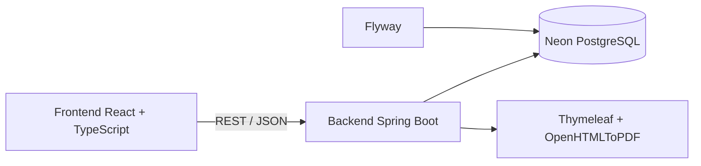
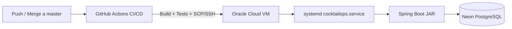
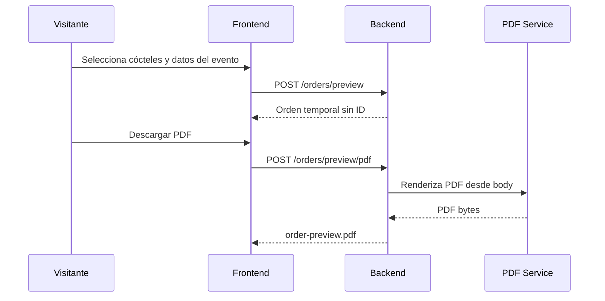
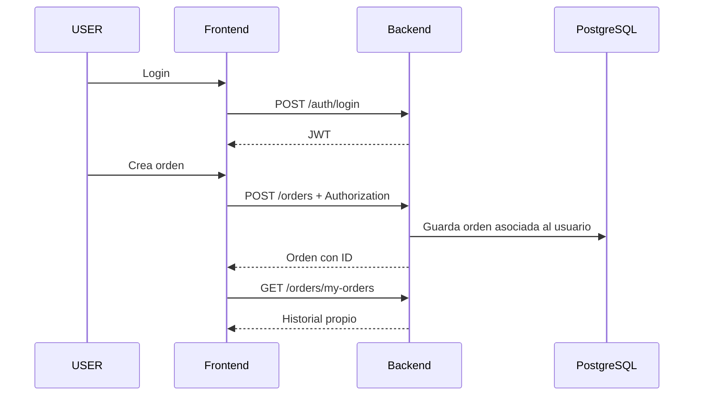

# CocktailOps Backend

Backend REST API de **CocktailOps**, desarrollado con **Java 17**, **Spring Boot**, **PostgreSQL** y **Flyway**.

Este módulo contiene la lógica principal del sistema: autenticación JWT, autorización por roles, catálogo de productos/cócteles, cálculo de órdenes, generación de PDF, historial de usuario, ownership de recursos y endpoints públicos de preview para visitantes.

---

## Índice

- [Descripción](#descripción)
- [Estado actual](#estado-actual)
- [Reglas principales del producto](#reglas-principales-del-producto)
- [Decisiones técnicas](#decisiones-técnicas)
- [Tecnologías utilizadas](#tecnologías-utilizadas)
- [Autenticación y seguridad](#autenticación-y-seguridad)
- [Cálculo de órdenes](#cálculo-de-órdenes)
- [PDF y lista de compra](#pdf-y-lista-de-compra)
- [Catálogo demo y migraciones](#catálogo-demo-y-migraciones)
- [Instalación y uso local](#instalación-y-uso-local)
- [API - Endpoints principales](#api---endpoints-principales)
- [Integración con frontend](#integración-con-frontend)
- [Testing](#testing)
- [Deploy e infraestructura](#deploy-e-infraestructura)
- [Diagramas](#diagramas)
- [Próximos pasos](#próximos-pasos)
- [Autor](#autor)

---

## Descripción

CocktailOps Backend permite calcular insumos para eventos a partir de una selección de cócteles.

La API permite trabajar en dos modos:

```txt
TIME   → cálculo por invitados + duración del evento + preferencia/peso de cócteles
DRINKS → cálculo por cantidad total exacta de tragos + cantidad por cóctel
```

A partir de esos datos, el backend calcula:

- cantidad total de tragos
- distribución de tragos por cóctel
- ingredientes requeridos
- acumulación por producto
- packs, botellas o unidades sugeridas a comprar
- PDF con resumen del evento y lista de compra

El proyecto está pensado como una aplicación full stack de portfolio, mostrando un flujo completo entre frontend, backend, base de datos, seguridad, PDF, migraciones, Docker, testing, CI/CD y despliegue cloud.

---

## Estado actual

| Módulo | Estado |
|---|---|
| API Spring Boot | Implementado |
| PostgreSQL + Flyway | Implementado |
| Seed demo de catálogo | Implementado |
| Catálogo ampliado de cócteles | Implementado |
| Normalización de unidades | Implementado |
| Autenticación JWT | Implementado |
| Roles USER / ADMIN | Implementado |
| Endpoints públicos de catálogo | Implementado |
| Preview público de órdenes | Implementado |
| Creación persistente de órdenes autenticadas | Implementado |
| Historial de usuario | Implementado |
| Ownership sobre detalle y PDF | Implementado |
| PDF protegido por ID | Implementado |
| PDF preview desde body | Implementado |
| Dashboard frontend por rol soportado por API | Implementado |
| Límite de órdenes persistidas por usuario | Implementado |
| Tests unitarios backend | Implementado |
| GitHub Actions CI/CD | Implementado |
| PostgreSQL en Neon | Implementado |
| Deploy backend en Oracle Cloud | Implementado |
| Servicio systemd | Implementado |
| Health check de deploy | Implementado |
| Backup y rollback automático de JAR | Implementado |
| Deploy frontend en Vercel | Pendiente |
| Proxy/HTTPS público para frontend | Pendiente |

---

## Reglas principales del producto

### Invitado

Un visitante sin login puede:

- consultar productos
- consultar cócteles
- generar una orden temporal por modo `TIME`
- generar una orden temporal por modo `DRINKS`
- ver el resultado inmediato en frontend
- descargar un PDF de preview

Un visitante no puede:

- guardar órdenes en historial
- acceder a `/orders/my-orders`
- acceder a `/orders/{id}`
- descargar PDFs mediante `/orders/{id}/pdf`

Las órdenes de invitado son **temporales**:

```txt
No se persisten en base de datos.
No tienen ID real.
No quedan asociadas a usuario.
No aparecen en historial.
El PDF se genera desde el body enviado por el frontend.
```

### Usuario autenticado

Un usuario con rol `USER` puede:

- iniciar sesión
- crear órdenes reales y guardadas
- asociar órdenes a su cuenta
- consultar su historial
- ver detalle de sus órdenes
- descargar PDF por ID de sus propias órdenes

Para proteger la demo pública y limitar el crecimiento innecesario de la base, cada usuario autenticado puede guardar como máximo **20 órdenes dentro de una ventana móvil de 24 horas**.

```txt
Máximo: 20 órdenes persistidas por usuario / 24 h
Al alcanzar el límite: HTTP 429 Too Many Requests
```

El límite se aplica únicamente a las órdenes persistentes. Los previews temporales no cuentan porque no se guardan en base de datos.

### Administrador

Un usuario con rol `ADMIN` puede:

- acceder a endpoints administrativos
- listar órdenes del sistema
- acceder al detalle de órdenes de cualquier usuario
- descargar PDFs de cualquier orden
- administrar catálogo mediante endpoints protegidos

---

## Decisiones técnicas

### Arquitectura por capas

El backend sigue una arquitectura por capas:

```txt
Controller → Service → Repository
```

Responsabilidades:

- **Controller**: expone endpoints HTTP, recibe requests, devuelve responses y documenta con Swagger.
- **Service**: contiene reglas de negocio, validaciones, cálculo de órdenes, ownership y generación de respuestas.
- **Repository**: accede a base de datos mediante Spring Data JPA.

Esta separación mejora la mantenibilidad, facilita el testing y evita mezclar reglas de negocio con detalles HTTP o persistencia.

### DTOs en lugar de entidades

La API trabaja con DTOs para requests y responses.

Motivos:

- evitar exponer entidades JPA directamente
- mantener estable el contrato de API
- validar inputs con Bean Validation
- controlar qué información se devuelve al frontend
- evitar problemas de serialización con relaciones lazy
- mejorar documentación Swagger/OpenAPI

Ejemplo:

```txt
GET /products devuelve categoryId y categoryName.
```

De esta forma el frontend puede mostrar la categoría del producto sin hacer una request adicional por cada producto.

### Preview separado de creación persistente

El backend separa claramente dos operaciones:

```txt
preview → calcula una orden pero no guarda
create  → calcula una orden y guarda en base
```

Esto evita que un visitante genere registros persistidos solo por probar el sistema.

Endpoints preview:

```http
POST /orders/preview
POST /orders/by-drinks/preview
POST /orders/preview/pdf
POST /orders/by-drinks/preview/pdf
```

Endpoints persistentes:

```http
POST /orders
POST /orders/by-drinks
```

Los endpoints persistentes requieren usuario autenticado.

### Ownership de recursos

El backend valida acceso a órdenes guardadas.

Regla:

```txt
ADMIN → puede acceder a cualquier orden
USER  → solo puede acceder a sus propias órdenes
```

Esto aplica especialmente a:

```http
GET /orders/{id}
GET /orders/{id}/pdf
```

### Límite de órdenes persistidas

La API limita la cantidad de órdenes que puede persistir un usuario autenticado:

```txt
20 órdenes guardadas como máximo dentro de las últimas 24 horas.
```

La validación se realiza antes de persistir una nueva orden, consultando cuántas órdenes creó el usuario desde `Instant.now() - 24 h`.

Si el límite fue alcanzado, el backend responde:

```http
429 Too Many Requests
```

Esta regla protege la base de datos y los recursos de la demo sin impedir que un visitante utilice los endpoints de preview.

### Flyway

Flyway versiona la base de datos con migraciones SQL.

Ventajas:

- base reproducible
- evolución controlada del esquema
- seed demo versionado
- trazabilidad de cambios
- integración simple con CI y entornos locales

### Manejo global de errores

El backend centraliza errores con `@RestControllerAdvice`.

Casos cubiertos:

- validaciones inválidas
- recursos no encontrados
- reglas de negocio incumplidas
- credenciales inválidas
- accesos prohibidos
- límite de uso alcanzado (`429 Too Many Requests`)
- errores inesperados
- errores de generación de PDF

### Logging

Los servicios principales incluyen logs para seguir flujos importantes:

- creación de órdenes
- preview de órdenes
- búsqueda por ID
- generación de PDF
- errores esperados e inesperados

---

## Tecnologías utilizadas

- Java 17
- Spring Boot
- Maven
- PostgreSQL
- Spring Data JPA
- Hibernate
- Flyway
- Spring Security
- JWT
- Swagger / OpenAPI
- Thymeleaf
- OpenHTMLToPDF
- JUnit 5
- Mockito
- H2 para tests
- Docker Compose
- GitHub Actions CI/CD
- Oracle Cloud Infrastructure
- Ubuntu 24.04
- systemd
- Neon PostgreSQL
- SSH / SCP para despliegue
- Lombok

---

## Autenticación y seguridad

El backend utiliza **Spring Security + JWT**.

Flujo:

```txt
POST /auth/register
→ crea usuario USER
→ devuelve token JWT

POST /auth/login
→ valida credenciales
→ devuelve token JWT
```

Para requests protegidas:

```http
Authorization: Bearer <token>
```

### Reglas de acceso

| Endpoint | Acceso |
|---|---|
| `POST /auth/register` | Público |
| `POST /auth/login` | Público |
| Swagger / OpenAPI | Público |
| `GET /products` | Público |
| `GET /cocktails` | Público |
| `GET /categories` | Público |
| `POST /orders/preview` | Público |
| `POST /orders/by-drinks/preview` | Público |
| `POST /orders/preview/pdf` | Público |
| `POST /orders/by-drinks/preview/pdf` | Público |
| `POST /orders` | Usuario autenticado |
| `POST /orders/by-drinks` | Usuario autenticado |
| `GET /orders/my-orders` | Usuario autenticado |
| `GET /orders/{id}` | Dueño de la orden o ADMIN |
| `GET /orders/{id}/pdf` | Dueño de la orden o ADMIN |
| `GET /orders` | ADMIN |
| Escritura de catálogo | ADMIN |
| `/user/**` | ADMIN |
| `/shop/**` | ADMIN |

### Protección de creación persistente

Los endpoints que guardan órdenes requieren autenticación y respetan el límite de uso por usuario:

```txt
POST /orders
POST /orders/by-drinks

→ máximo 20 órdenes persistidas por usuario dentro de 24 horas
→ exceso de límite: 429 Too Many Requests
```

Los endpoints públicos de preview permanecen separados y no generan registros persistidos.

---

## Cálculo de órdenes

### Modo TIME

El modo `TIME` calcula la cantidad total de tragos a partir de:

```txt
invitados × duración × tragos por persona por hora
```

Ejemplo base:

```txt
60 invitados × 5 horas × 1 trago/persona/hora = 300 tragos
```

Además, el sistema aplica una estimación reforzada para eventos grandes con muchas opciones de cócteles:

```txt
Si invitados >= 60
y cócteles seleccionados >= 8
→ usa 2 tragos por persona por hora
```

Ejemplo:

```txt
60 invitados × 5 horas × 2 tragos/persona/hora = 600 tragos
```

Para eventos más chicos, aunque haya muchos cócteles, se mantiene la estimación conservadora:

```txt
40 invitados × 5 horas × 1 trago/persona/hora = 200 tragos
```

Esta regla evita inflar demasiado eventos pequeños y permite reforzar estimaciones para eventos grandes con mucha variedad.

### Pesos por cóctel

En modo `TIME`, cada cóctel puede recibir un `weight`.

El peso indica preferencia relativa:

```txt
Más peso → más tragos asignados a ese cóctel.
Menos peso → menos tragos asignados.
```

Ejemplo:

```txt
totalDrinks = 100

Mojito weight = 1
Daiquiri weight = 1
Gin Tonic weight = 2

Resultado:
Mojito    = 25
Daiquiri  = 25
Gin Tonic = 50
```

### Modo DRINKS

El modo `DRINKS` no estima por invitados ni duración.

El usuario indica:

- total exacto de tragos
- cantidad de tragos por cóctel

Regla:

```txt
La suma de cantidades por cóctel debe ser igual a totalDrinks.
```

Ejemplo:

```json
{
  "totalDrinks": 100,
  "cocktails": [
    { "cocktailId": 1, "quantity": 25 },
    { "cocktailId": 2, "quantity": 25 },
    { "cocktailId": 3, "quantity": 25 },
    { "cocktailId": 4, "quantity": 25 }
  ]
}
```

### Acumulación de ingredientes

El sistema no calcula botellas por cóctel de forma separada.

Primero acumula los ingredientes por producto y luego calcula la compra sugerida.

Ejemplo:

```txt
Mojito usa Ron
Daiquiri usa Ron

El sistema suma todo el ron requerido.
Después calcula cuántas botellas comprar.
```

Esto evita duplicar productos y genera una lista de compra más realista.

### Unidades soportadas

El sistema soporta y normaliza unidades de producto:

```txt
ML
GR
UNID
```

También acepta variantes en datos heredados/locales, como:

```txt
ml / ML
g / G / gr / GR
unid / UNID / unit / UNIT
```

Las recetas pueden usar onzas (`OZ`) y el backend convierte a la unidad del producto cuando corresponde:

```txt
OZ → ML
OZ → GR
```

No se hacen conversiones ambiguas como:

```txt
UNID → GR
UNID → ML
```

Cuando un producto se compra en gramos, la receta también debe estar expresada en gramos.

---

## PDF y lista de compra

El backend genera PDFs con **Thymeleaf + OpenHTMLToPDF**.

Tipos de PDF:

| Caso | Endpoint |
|---|---|
| Orden guardada | `GET /orders/{id}/pdf` |
| Preview TIME | `POST /orders/preview/pdf` |
| Preview DRINKS | `POST /orders/by-drinks/preview/pdf` |

### PDF protegido por ID

```http
GET /orders/{id}/pdf
Authorization: Bearer <token>
```

Reglas:

```txt
USER  → solo PDF de órdenes propias
ADMIN → cualquier PDF
```

### PDF preview público

```http
POST /orders/preview/pdf
POST /orders/by-drinks/preview/pdf
```

Estos endpoints reciben el body de la orden y devuelven un PDF sin acceder a una orden persistida.

Esto permite que un visitante descargue una lista de compra sin registrarse.

### Interpretación de la compra sugerida

La lista de compra no representa una compra “exacta” sin sobrantes.

Representa la cantidad mínima de packs, botellas o unidades necesarias para poder preparar hasta la cantidad total de tragos estimada.

Ejemplo:

```txt
Ron requerido: 1600 ML
Botella: 750 ML

1600 / 750 = 2.13
Resultado: comprar 3 botellas
```

Por eso el PDF incluye una aclaración:

```txt
Las cantidades sugeridas están calculadas para poder preparar hasta la cantidad total de tragos estimada.
Los productos se redondean hacia arriba según su formato de compra, por ejemplo botellas, packs o unidades, por lo que puede sobrar producto al finalizar el evento.
```

### Fecha del PDF

Para órdenes temporales y guardadas, el backend asigna fecha de creación y el PDF la muestra en formato:

```txt
dd/MM/yyyy
```

Ejemplo:

```txt
21/08/2026
```

---

## Catálogo demo y migraciones

El catálogo demo se carga mediante Flyway.

Incluye:

- categorías
- productos base
- productos adicionales
- cócteles clásicos
- cócteles modernos
- ingredientes por cóctel
- normalización de unidades

Migraciones destacadas:

| Migración | Descripción |
|---|---|
| `V1__initial_schema.sql` | Esquema inicial |
| `V6__add_user_id_to_orders.sql` | Asociación Order → User |
| `V7__seed_demo_catalog_data.sql` | Catálogo demo inicial |
| `V8__add_more_demo_cocktails.sql` | Ampliación del catálogo de cócteles |
| `V9__fix_sugar_ingredient_units.sql` | Corrección de azúcar en recetas |
| `V10__normalize_demo_catalog_units.sql` | Normalización de unidades y catálogo demo |

### Cócteles demo

El catálogo demo incluye aproximadamente 30 cócteles, entre ellos:

- Mojito
- Daiquiri
- Gin Tonic
- Margarita
- Fernet Cola
- Aperol Spritz
- Cuba Libre
- Negroni
- Old Fashioned
- Whisky Sour
- Tom Collins
- Dry Martini
- Cosmopolitan
- Moscow Mule
- Paloma
- Caipirinha
- Caipiroska
- Piña Colada
- Sex on the Beach
- Espresso Martini
- Tequila Sunrise
- Americano
- Garibaldi
- French 75
- Bellini
- Vodka Tonic
- Campari Tonic
- Gin Fizz
- Vodka Collins
- Caipirissima

Este catálogo permite que el frontend ofrezca búsqueda manual y listas rápidas predefinidas.

---

## Instalación y uso local

### Requisitos

- Java 17
- Maven
- Docker Desktop
- Docker Compose
- PostgreSQL local solo si no se usa Docker

### Clonar repositorio

```bash
git clone https://github.com/Fran3103/CocktailOps.git
cd CocktailOps
```

### Levantar PostgreSQL con Docker Compose

El `docker-compose.yml` está en la raíz del proyecto.

```bash
docker compose up -d
```

El contenedor expone PostgreSQL localmente en:

```txt
localhost:5434
```

Verificar contenedor:

```bash
docker compose ps
```

### Configuración local

Crear el archivo:

```txt
backend/src/main/resources/application-local.properties
```

Tomar como base:

```txt
backend/src/main/resources/application-local.example.properties
```

Ejemplo recomendado para Docker local:

```properties
server.port=8081

spring.datasource.url=jdbc:postgresql://127.0.0.1:5434/cocktailOps_db?sslmode=disable
spring.datasource.username=postgres
spring.datasource.password=admin
spring.datasource.driver-class-name=org.postgresql.Driver

spring.flyway.enabled=true
spring.flyway.locations=classpath:db/migration

spring.jpa.hibernate.ddl-auto=validate
spring.jpa.properties.hibernate.jdbc.time_zone=UTC

spring.jackson.time-zone=UTC

order.drinksPerPersonPerHour=1

security.jwt.secret=local-dev-secret-key-32-characters-minimum-change-me-123456

springdoc.swagger-ui.path=/swagger-ui.html
springdoc.api-docs.path=/v3/api-docs
```

> `application-local.properties` no debe versionarse porque puede contener credenciales locales.

### Ejecutar backend

Desde `backend/`:

```bash
mvn spring-boot:run "-Dspring-boot.run.profiles=local"
```

O desde la raíz:

```bash
mvn -f backend/pom.xml spring-boot:run "-Dspring-boot.run.profiles=local"
```

### Ejecutar tests y build

Desde `backend/`:

```bash
mvn clean install
```

Desde la raíz:

```bash
mvn -f backend/pom.xml clean install
```

### Swagger UI

Con la aplicación corriendo:

```txt
http://localhost:8081/swagger-ui/index.html
```

### Apagar PostgreSQL

```bash
docker compose down
```

Para borrar también el volumen:

```bash
docker compose down -v
```

> Usar `docker compose down -v` solo si se quiere reconstruir completamente la base local.

---

## API - Endpoints principales

### Auth

#### Registro

```http
POST /auth/register
```

Body:

```json
{
  "email": "usuario@ejemplo.com",
  "password": "123456",
  "firstName": "Juan",
  "lastName": "Pérez"
}
```

#### Login

```http
POST /auth/login
```

Body:

```json
{
  "email": "usuario@ejemplo.com",
  "password": "123456"
}
```

Respuesta esperada:

```json
{
  "id": 1,
  "email": "usuario@ejemplo.com",
  "firstName": "Juan",
  "lastName": "Pérez",
  "role": "USER",
  "token": "eyJhbGciOiJIUzI1NiJ9..."
}
```

### Catálogo

#### Listar productos

```http
GET /products
```

Respuesta simplificada:

```json
[
  {
    "productId": 1,
    "name": "Gin",
    "unit": "ML",
    "unitSize": 750.00,
    "active": true,
    "imageUrl": null,
    "imageAlt": "Botella de gin",
    "categoryId": 1,
    "categoryName": "Alcoholes"
  }
]
```

#### Listar cócteles

```http
GET /cocktails
```

#### Listar categorías

```http
GET /categories
```

Las operaciones de escritura del catálogo requieren rol `ADMIN`.

### Preview de orden TIME

```http
POST /orders/preview
```

Body:

```json
{
  "guests": 60,
  "durationHours": 5,
  "cocktails": [
    { "cocktailId": 1, "weight": 3 },
    { "cocktailId": 2, "weight": 2 },
    { "cocktailId": 3, "weight": 1 }
  ]
}
```

Características:

```txt
Público.
No guarda en base.
No devuelve ID persistente.
Sirve para invitado.
```

### Crear orden TIME guardada

```http
POST /orders
Authorization: Bearer <token>
```

Body:

```json
{
  "guests": 60,
  "durationHours": 5,
  "cocktails": [
    { "cocktailId": 1, "weight": 3 },
    { "cocktailId": 2, "weight": 2 },
    { "cocktailId": 3, "weight": 1 }
  ]
}
```

Características:

```txt
Requiere usuario autenticado.
Guarda en base.
Asocia la orden al usuario.
Aparece en historial.
Permite detalle y PDF por ID.
Respeta el límite de 20 órdenes persistidas por usuario dentro de 24 horas.
```

### Preview de orden DRINKS

```http
POST /orders/by-drinks/preview
```

Body:

```json
{
  "totalDrinks": 100,
  "cocktails": [
    { "cocktailId": 1, "quantity": 25 },
    { "cocktailId": 2, "quantity": 25 },
    { "cocktailId": 3, "quantity": 25 },
    { "cocktailId": 4, "quantity": 25 }
  ]
}
```

Características:

```txt
Público.
No guarda en base.
La suma de quantity debe ser igual a totalDrinks.
```

### Crear orden DRINKS guardada

```http
POST /orders/by-drinks
Authorization: Bearer <token>
```

Body:

```json
{
  "totalDrinks": 100,
  "cocktails": [
    { "cocktailId": 1, "quantity": 25 },
    { "cocktailId": 2, "quantity": 25 },
    { "cocktailId": 3, "quantity": 25 },
    { "cocktailId": 4, "quantity": 25 }
  ]
}
```

Al igual que `POST /orders`, este endpoint respeta el límite de **20 órdenes persistidas por usuario dentro de 24 horas**.

### Historial propio

```http
GET /orders/my-orders
Authorization: Bearer <token>
```

Devuelve únicamente órdenes asociadas al usuario autenticado.

### Detalle de orden

```http
GET /orders/{id}
Authorization: Bearer <token>
```

Reglas:

```txt
USER  → solo órdenes propias
ADMIN → cualquier orden
```

### Listado administrativo de órdenes

```http
GET /orders
Authorization: Bearer <token-admin>
```

Devuelve las órdenes del sistema para el dashboard administrativo.

### PDF de orden guardada

```http
GET /orders/{id}/pdf
Authorization: Bearer <token>
```

Reglas:

```txt
USER  → solo PDF de órdenes propias
ADMIN → cualquier PDF
```

### PDF preview TIME

```http
POST /orders/preview/pdf
```

Devuelve:

```txt
Content-Type: application/pdf
filename: order-preview.pdf
```

### PDF preview DRINKS

```http
POST /orders/by-drinks/preview/pdf
```

Devuelve:

```txt
Content-Type: application/pdf
filename: order-preview.pdf
```

---

## Integración con frontend

El frontend consume este backend mediante Axios y una variable de entorno:

```env
VITE_API_BASE_URL=http://localhost:8081
```

Ese valor corresponde al entorno local. El frontend productivo todavía está pendiente de despliegue en Vercel. La integración pública final se configurará mediante una URL HTTPS del frontend y un proxy/rewrite hacia el backend desplegado en Oracle.

Funcionalidades actualmente soportadas desde frontend:

- login
- registro
- persistencia de sesión en `localStorage`
- catálogo de productos
- catálogo de cócteles
- creación de orden temporal para invitado
- creación de orden guardada para usuario autenticado
- preview JSON para invitado
- preview PDF para invitado
- PDF por ID para orden guardada
- historial de usuario
- detalle de orden protegida
- dashboard por tipo de usuario
- dashboard administrativo con órdenes del sistema
- listas rápidas de cócteles

### Listas rápidas del frontend

El frontend incluye presets de cócteles por caso de uso:

- Clásicos simples
- Clásicos completos
- Boda / evento elegante
- Modernos y fiesta
- Verano / tropical
- Aperitivos
- Premium clásico
- Popular y rápido

Los presets seleccionan cócteles por nombre y asignan pesos iniciales.

Después el usuario puede ajustar manualmente:

```txt
Modo TIME   → pesos/preferencias
Modo DRINKS → cantidades por cóctel
```

### Explicación visual de cálculo

El frontend muestra aclaraciones para que el usuario entienda:

- cuándo una orden es temporal
- cuándo se guarda en historial
- qué significa el peso de un cóctel
- qué significa la estimación de tragos
- que la lista de compra se redondea por botella, pack o unidad

---

## Testing

El backend incorpora tests con **JUnit 5**, **Mockito** y un perfil de test separado.

La suite actual ejecutada tanto localmente como en GitHub Actions contiene **31 tests**:

| Área | Estado actual |
|---|---|
| Contexto Spring Boot | Implementado |
| ProductServiceImpl | 17 tests |
| OrderServiceImpl | 13 tests |
| Límite de órdenes por usuario | Cubierto |
| Auth/Security | Pendiente de ampliar |
| PDF preview | Pendiente de ampliar |
| Ownership | Pendiente de ampliar |
| Controller tests | Pendiente |

La protección de uso incorpora un test específico que verifica que, cuando un usuario alcanza el límite permitido:

```txt
se lanza RateLimitExceededException
no se ejecuta orderRepository.save(...)
```

El pipeline de CI ejecuta:

```bash
mvn -B clean install
```

y el deploy no continúa si el build o cualquier test falla.

Mejoras de testing que siguen siendo opcionales para futuras iteraciones:

- ampliar tests de autenticación y autorización
- probar ownership de detalle y PDF en más escenarios
- agregar tests de generación de PDF
- agregar tests de controller/HTTP para endpoints principales


---

## Deploy e infraestructura

El backend está desplegado en **Oracle Cloud Infrastructure** sobre una VM Ubuntu 24.04 y utiliza **Neon PostgreSQL** como base de datos remota.

### Arquitectura de despliegue

```txt
GitHub
  ↓ push a master
GitHub Actions
  ↓ build + tests
JAR Spring Boot
  ↓ SSH / SCP
Oracle Cloud VM
  ↓ systemd
CocktailOps Backend
  ↓ JDBC
Neon PostgreSQL
```

### Oracle Cloud

El backend se ejecuta como servicio del sistema:

```txt
cocktailops.service
```

Archivo principal desplegado:

```txt
/opt/cocktailops/cocktailops.jar
```

Variables de entorno productivas:

```txt
/opt/cocktailops/cocktailops.env
```

El archivo de entorno permanece únicamente en la VM y no se versiona.

El servicio utiliza `systemd`, por lo que:

- arranca automáticamente después de reiniciar la VM
- puede reiniciarse de forma controlada durante un deploy
- los logs pueden consultarse con `journalctl`
- `Restart=on-failure` permite recuperar el proceso ante fallos de ejecución

Ejemplo de consulta de logs:

```bash
sudo journalctl -u cocktailops.service -f
```

### Base de datos en Neon

La base productiva/demo utiliza PostgreSQL administrado por **Neon**.

Configuración actual orientada a una demo de portfolio:

```txt
Plan: Free
Autoscaling: 0.25 → 0.5 CU
Scale to zero: 5 minutos
```

Esto reduce consumo cuando la aplicación permanece inactiva.

### Health check

La API expone:

```http
GET /healthz
```

Respuesta esperada:

```json
{
  "status": "ok"
}
```

Este endpoint se utiliza tanto para comprobaciones manuales como para validar despliegues automáticos.

### CI/CD con GitHub Actions

El workflow se ejecuta en:

```txt
push a master
pull request hacia master
```

En un pull request se ejecuta CI:

```txt
checkout
→ Java 17
→ Maven build
→ tests
```

En un push a `master`, después de superar CI, también se ejecuta CD:

```txt
build + 31 tests
→ generar JAR
→ conectar por SSH a Oracle
→ copiar JAR nuevo
→ crear backup del JAR anterior
→ reemplazar aplicación
→ reiniciar cocktailops.service
→ esperar health check
```

El health check permite hasta aproximadamente **180 segundos**, contemplando el arranque más lento de una VM pequeña y una base Neon que puede estar suspendida.

### Rollback automático

Antes de reemplazar la versión activa, el workflow conserva:

```txt
/opt/cocktailops/cocktailops.jar.bak
```

Si la versión nueva no logra responder correctamente a `/healthz` dentro del tiempo configurado:

```txt
health check falla
→ se restaura cocktailops.jar.bak
→ systemd reinicia el servicio
→ se vuelve a comprobar /healthz
```

Aunque el rollback funcione, GitHub Actions deja el workflow en estado fallido para indicar que la nueva versión no pudo desplegarse.

### Secretos del deploy

La clave SSH privada utilizada por GitHub Actions se almacena como **GitHub Actions Secret** y no forma parte del repositorio.

El host y el usuario SSH se gestionan mediante variables del repositorio.

No se versionan:

- clave SSH privada
- contraseña de Neon
- JWT secret
- archivo `cocktailops.env`

### Estado de acceso público

El backend ya está desplegado y operativo en Oracle. La capa pública definitiva para el frontend todavía está pendiente de cierre.

El siguiente paso será desplegar el frontend en Vercel y configurar la comunicación HTTPS/proxy hacia Oracle. Después se podrá endurecer el acceso directo al backend y aplicar rate limiting por IP en la capa de entrada.


---

## Diagramas

### Arquitectura general



### Arquitectura de despliegue



### Flujo de invitado



### Flujo de usuario autenticado



---

## Próximos pasos

### Cierre de despliegue full stack

- Desplegar frontend React/Vite en Vercel
- Configurar la URL productiva del frontend
- Configurar proxy/rewrite HTTPS desde Vercel hacia el backend de Oracle
- Ajustar CORS según la URL definitiva
- Verificar flujo completo desplegado:
  - invitado
  - registro y login
  - USER
  - ADMIN
  - orden TIME
  - orden DRINKS
  - historial
  - ownership
  - PDF preview
  - PDF por ID
  - límite de 20 órdenes / 24 h
- Revisar y restringir el acceso directo a `:8080` cuando la capa pública final esté definida
- Incorporar rate limiting por IP para endpoints públicos sensibles en la capa de entrada
- Actualizar README raíz con la arquitectura y URLs definitivas
- Preparar capturas y documentación final para portfolio

### Mejoras futuras no bloqueantes

Estas mejoras pueden aportar valor, pero no son necesarias para considerar el backend listo como proyecto de portfolio:

- ampliar tests de seguridad, ownership y PDF
- verificación de email
- reset de contraseña
- panel administrativo más completo para catálogo
- auditoría de órdenes
- mejoras adicionales de Swagger/OpenAPI
- colección Postman del flujo completo
- Dockerfile del backend si se quiere ofrecer una alternativa de ejecución empaquetada


---

## Autor

Proyecto desarrollado por **Franco Aguirre** como parte de su portfolio profesional full stack.

Stack trabajado:

- Java
- Spring Boot
- PostgreSQL
- Flyway
- Spring Security
- JWT
- React
- TypeScript
- Testing
- GitHub Actions CI/CD
- Oracle Cloud
- Neon PostgreSQL
- QA Manual
