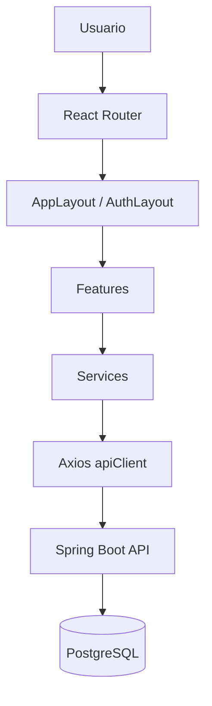
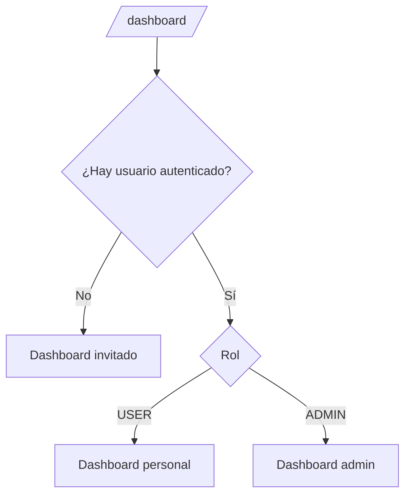
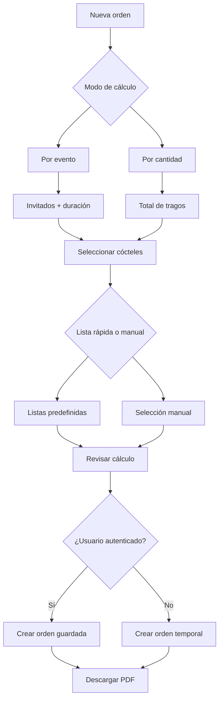
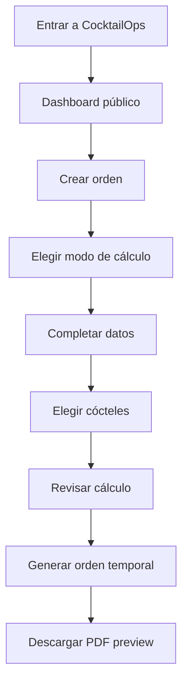
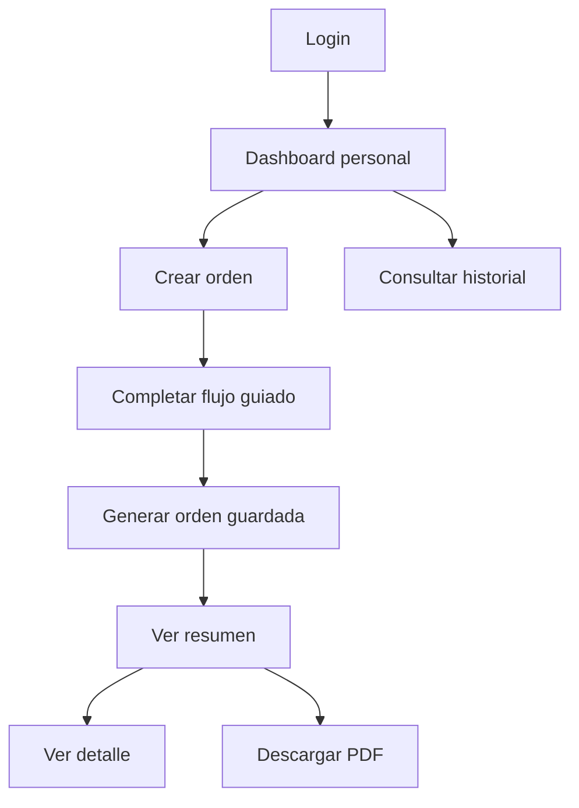
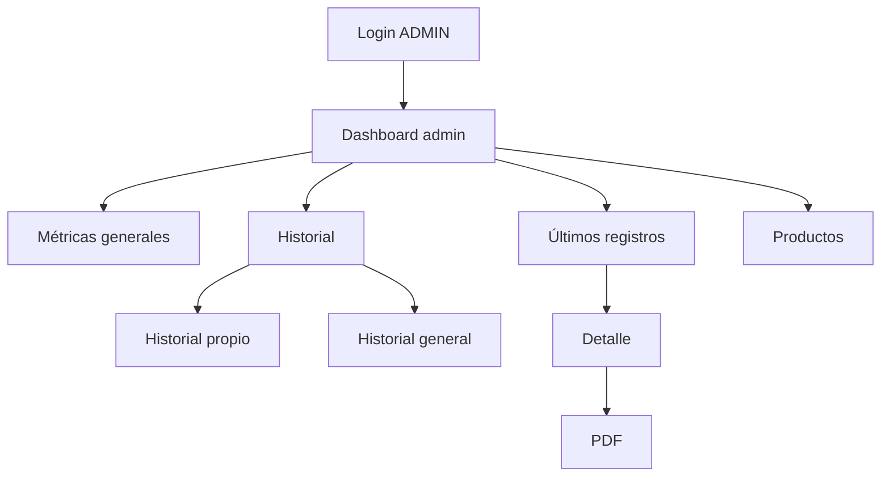

# CocktailOps Frontend

Interfaz web de **CocktailOps**, una aplicación full stack para calcular bebidas, cócteles, insumos y packs necesarios para eventos.

El frontend está desarrollado con **React**, **Vite**, **TypeScript** y **Tailwind CSS**, consume una API REST construida con **Java + Spring Boot** y forma parte de un proyecto portfolio no comercial orientado a demostrar desarrollo full stack aplicado a un caso real.

---

## Índice

- [Demo](#demo)
- [Descripción](#descripción)
- [Objetivo del frontend](#objetivo-del-frontend)
- [Stack técnico](#stack-técnico)
- [Arquitectura](#arquitectura)
- [Reglas de acceso](#reglas-de-acceso)
- [Funcionalidades principales](#funcionalidades-principales)
- [Flujos de uso](#flujos-de-uso)
- [Rutas](#rutas)
- [Integración con backend](#integración-con-backend)
- [Variables de entorno](#variables-de-entorno)
- [Instalación y uso local](#instalación-y-uso-local)
- [Deploy](#deploy)
- [Manejo de sesión](#manejo-de-sesión)
- [Manejo de errores](#manejo-de-errores)
- [Diseño y experiencia de usuario](#diseño-y-experiencia-de-usuario)
- [Estructura del proyecto](#estructura-del-proyecto)
- [Estado actual](#estado-actual)
- [Próximas mejoras](#próximas-mejoras)
- [Autor](#autor)

---

## Demo

Frontend desplegado:

```txt
https://cocktailops.vercel.app
```

Portfolio:

```txt
https://franaguirredev.com
```

Repositorio:

```txt
https://github.com/Fran3103/CocktailOps
```

---

## Descripción

CocktailOps Frontend permite utilizar visualmente el sistema CocktailOps desde el navegador.

La aplicación permite calcular una orden de cócteles para eventos, obtener los productos necesarios, visualizar el resultado y descargarlo en PDF.

El sistema contempla tres formas de uso:

```txt
Invitado → calcula una orden temporal sin registrarse
USER     → crea órdenes guardadas y consulta su historial
ADMIN    → consulta métricas generales y accede a productos
```

El foco del frontend es presentar una interfaz clara, responsive y mantenible, conectada a un backend real.

---

## Objetivo del frontend

El objetivo principal es convertir la API REST de CocktailOps en una experiencia usable para el usuario final.

La necesidad que resuelve es:

```txt
Tengo un evento
→ quiero preparar cócteles
→ necesito estimar tragos, insumos y packs
→ quiero revisar el cálculo
→ quiero descargar una orden en PDF
```

La aplicación puede usarse sin iniciar sesión. La autenticación agrega funcionalidades persistentes como historial, perfil y acceso posterior a órdenes guardadas.

---

## Stack técnico

| Área | Tecnología |
|---|---|
| UI | React |
| Build tool | Vite |
| Lenguaje | TypeScript |
| Estilos | Tailwind CSS |
| Routing | React Router |
| HTTP client | Axios |
| Iconos | Lucide React |
| Estado de sesión | Context API + localStorage |
| Deploy | Vercel |
| Backend consumido | Java + Spring Boot |
| Base de datos backend | PostgreSQL |

Scripts principales:

```bash
npm run dev
npm run build
npm run lint
npm run preview
```

---

## Arquitectura

El frontend está organizado por **features**. Cada feature agrupa componentes, servicios, tipos, hooks y lógica relacionada a un dominio funcional.

```txt
src/
├── api/
├── app/
├── features/
│   ├── auth/
│   ├── cocktails/
│   ├── dashboard/
│   ├── orders/
│   ├── products/
│   └── profiles/
├── layouts/
├── shared/
└── styles/
```

### Diagrama general



### Criterio de separación

| Carpeta | Responsabilidad |
|---|---|
| `api/` | Cliente HTTP centralizado |
| `app/` | Configuración principal de rutas |
| `features/auth/` | Login, registro, sesión y rutas protegidas |
| `features/cocktails/` | Catálogo, filtros y búsqueda de cócteles |
| `features/dashboard/` | Dashboards para invitado, USER y ADMIN |
| `features/orders/` | Creación, historial, detalle y PDFs |
| `features/products/` | Catálogo interno de productos |
| `features/profiles/` | Perfil de usuario |
| `layouts/` | Layout general y layout de autenticación |
| `shared/` | Componentes, helpers, páginas y constantes reutilizables |
| `styles/` | Configuración visual global |

---

## Reglas de acceso

### Invitado

Un usuario invitado puede:

- ver el dashboard público;
- consultar cócteles;
- crear una orden temporal;
- usar listas rápidas;
- generar un cálculo;
- descargar PDF desde el resumen inmediato.

Un usuario invitado no puede:

- acceder al historial;
- acceder al perfil;
- acceder a productos;
- guardar órdenes en base de datos;
- recuperar una orden temporal al abandonar el flujo.

Regla principal:

```txt
Orden temporal:
- no se guarda;
- no tiene ID;
- no aparece en historial;
- permite descargar PDF desde el resumen generado.
```

---

### USER

Un usuario autenticado con rol `USER` puede:

- iniciar sesión;
- crear órdenes guardadas;
- ver dashboard personal;
- consultar historial propio;
- entrar al detalle de sus órdenes;
- descargar PDFs;
- acceder a su perfil.

---

### ADMIN

Un usuario autenticado con rol `ADMIN` puede:

- ver dashboard administrativo;
- consultar métricas generales;
- alternar entre historial propio e historial general;
- acceder al detalle de órdenes permitidas por backend;
- descargar PDFs según permisos;
- acceder al catálogo interno de productos.

---

## Funcionalidades principales

### Autenticación

El frontend permite:

- registrar usuario;
- iniciar sesión;
- mostrar u ocultar contraseña;
- guardar token y usuario en `localStorage`;
- adjuntar JWT automáticamente en requests protegidas;
- limpiar sesión inválida o vencida;
- redirigir a login cuando una ruta requiere autenticación;
- mostrar pantalla 403 cuando el usuario no tiene permisos.

---

### Dashboard por rol

La ruta `/dashboard` muestra una vista distinta según el estado de sesión.



Dashboard invitado:

- explica el objetivo de la app;
- permite iniciar una orden temporal;
- muestra cócteles populares;
- comunica que el historial requiere cuenta.

Dashboard USER:

- muestra historial personal resumido;
- muestra tragos calculados;
- muestra últimos registros;
- permite crear una nueva orden;
- permite ir al historial.

Dashboard ADMIN:

- muestra resumen general;
- muestra métricas del sistema;
- muestra últimos registros;
- permite ir al historial completo;
- mantiene acceso a productos.

---

### Catálogo de cócteles

La aplicación incluye un catálogo público de cócteles conectado al backend.

Permite:

- listar cócteles;
- buscar por texto;
- filtrar por tipo de preparación;
- paginar resultados;
- consultar ingredientes asociados;
- usar los cócteles dentro del flujo de creación de orden.

Tipos de preparación manejados en UI:

```txt
Todos
Directos
Batidos
Refrescados
Frozen
```

---

### Catálogo de productos

La vista de productos es de uso administrativo.

Permite consultar productos e insumos disponibles para el cálculo de bebidas.

Acceso:

```txt
ADMIN    → permitido
USER     → no permitido
Invitado → no permitido
```

---

### Creación de orden

La creación de orden se implementa como un flujo guiado en tres pasos.

```txt
Paso 1 → Datos del cálculo
Paso 2 → Selección de cócteles
Paso 3 → Revisión y generación
```

Diagrama:



---

### Modo por evento

En modo evento, el usuario define:

- cantidad de invitados;
- duración del evento;
- cócteles seleccionados;
- prioridad de cada cóctel.

La prioridad visible se transforma en `weight` para el backend.

| Prioridad visible | Valor enviado |
|---|---:|
| Baja | 1 |
| Normal | 2 |
| Media | 3 |
| Alta | 5 |

Ejemplo:

```txt
Invitados: 80
Duración: 5 horas

Fernet Cola   → Prioridad alta
Gin Tonic     → Prioridad normal
Aperol Spritz → Prioridad baja
```

Payload conceptual:

```json
{
  "guests": 80,
  "durationHours": 5,
  "cocktails": [
    {
      "cocktailId": 1,
      "weight": 5
    },
    {
      "cocktailId": 2,
      "weight": 2
    },
    {
      "cocktailId": 3,
      "weight": 1
    }
  ]
}
```

---

### Modo por cantidad de tragos

En modo cantidad, el usuario define:

- total de tragos;
- cócteles seleccionados;
- cantidad asignada a cada cóctel.

El frontend muestra un contador de asignación para evitar inconsistencias.

Ejemplo:

```txt
Total de tragos: 100

Fernet Cola   → 40
Gin Tonic     → 30
Aperol Spritz → 30

Asignados: 100 / 100
```

El usuario puede:

- asignar cantidades manualmente;
- usar una lista rápida;
- repartir equitativamente entre cócteles seleccionados;
- corregir excedentes o faltantes antes de avanzar.

---

### Listas rápidas predefinidas

El frontend incluye presets para acelerar la selección de cócteles.

Ejemplos:

- Clásicos simples
- Clásicos completos
- Boda / evento elegante
- Modernos y fiesta
- Verano / tropical
- Aperitivos
- Premium clásico
- Popular y rápido

Los presets usan nombres de cócteles y no IDs fijos. El frontend busca cada nombre dentro del catálogo real recibido desde backend.

Esto evita depender de IDs de base de datos.

---

### Resumen de orden creada

Cuando el backend responde correctamente, el frontend muestra un resumen de orden generada.

El resumen indica:

- si la orden es temporal o guardada;
- ID cuando existe;
- estado;
- cantidad total de tragos;
- cantidad de productos calculados;
- cantidad de cócteles incluidos;
- botón para descargar PDF;
- botón para crear una nueva orden.

En órdenes guardadas, también permite ir al detalle.

En órdenes temporales, el PDF debe descargarse desde el resumen inmediato.

---

### PDF

El frontend permite descargar PDFs desde distintas fuentes.

| Caso | Endpoint |
|---|---|
| Orden guardada | `GET /orders/{id}/pdf` |
| Orden temporal por evento | `POST /orders/preview/pdf` |
| Orden temporal por cantidad | `POST /orders/by-drinks/preview/pdf` |

Nombres de archivo:

```txt
Orden guardada  → order-{id}.pdf
Orden temporal  → order-preview.pdf
```

---

### Historial

El historial está disponible para usuarios autenticados.

USER:

```txt
GET /orders/my-orders
```

ADMIN:

```txt
GET /orders
GET /orders/my-orders
```

La vista permite:

- consultar registros;
- ver detalle;
- descargar PDF;
- alternar entre historial propio e historial general cuando el usuario es ADMIN;
- visualizar tabla en desktop y cards en mobile.

---

## Flujos de uso

### Flujo invitado



---

### Flujo usuario registrado



---

### Flujo administrador



---

## Rutas

### Rutas públicas

| Ruta | Descripción |
|---|---|
| `/login` | Inicio de sesión |
| `/register` | Registro de usuario |
| `/dashboard` | Dashboard según estado de sesión |
| `/cocktails` | Catálogo público de cócteles |
| `/create-order` | Creación de orden temporal o guardada |
| `/unauthorized` | Página de acceso no autorizado |
| `/404` | Página no encontrada |

---

### Rutas protegidas

| Ruta | Acceso | Descripción |
|---|---|---|
| `/orders` | USER / ADMIN | Historial |
| `/orders/:id` | USER / ADMIN | Detalle de orden guardada |
| `/profile` | USER / ADMIN | Perfil de usuario |
| `/products` | ADMIN | Catálogo interno de productos |

---

## Integración con backend

El frontend consume la API REST del backend a través de un cliente Axios centralizado.

Archivo:

```txt
src/api/apiClient.ts
```

Responsabilidades:

- leer `VITE_API_BASE_URL`;
- definir `baseURL`;
- configurar headers JSON;
- adjuntar `Authorization: Bearer <token>` cuando existe sesión activa.

---

### Endpoints consumidos

#### Autenticación

```http
POST /auth/register
POST /auth/login
```

#### Cócteles

```http
GET /cocktails
```

#### Productos

```http
GET /products
```

#### Órdenes guardadas

```http
POST /orders
POST /orders/by-drinks
GET /orders/my-orders
GET /orders
GET /orders/{id}
GET /orders/{id}/pdf
```

#### Órdenes temporales

```http
POST /orders/preview
POST /orders/by-drinks/preview
POST /orders/preview/pdf
POST /orders/by-drinks/preview/pdf
```

---

## Variables de entorno

Crear un archivo `.env.local` dentro de `frontend`.

### Desarrollo local

```env
VITE_API_BASE_URL=http://localhost:8080
```

### Producción con proxy de Vercel

```env
VITE_API_BASE_URL=/api
```

No versionar archivos `.env` o `.env.local` con datos sensibles o configuraciones locales privadas.

---

## Instalación y uso local

### 1. Clonar el repositorio

```bash
git clone https://github.com/Fran3103/CocktailOps.git
cd CocktailOps
```

### 2. Entrar al frontend

```bash
cd frontend
```

### 3. Instalar dependencias

```bash
npm install
```

### 4. Configurar entorno local

Crear `.env.local`:

```env
VITE_API_BASE_URL=http://localhost:8080
```

### 5. Ejecutar en desarrollo

```bash
npm run dev
```

URL local:

```txt
http://localhost:5173
```

### 6. Ejecutar lint

```bash
npm run lint
```

### 7. Generar build

```bash
npm run build
```

### 8. Previsualizar build

```bash
npm run preview
```

---

## Deploy

El frontend está desplegado en Vercel.

En producción, la app usa `/api` como base URL y Vercel reescribe las requests hacia el backend productivo.

Ejemplo conceptual:

```json
{
  "rewrites": [
    {
      "source": "/api/:path*",
      "destination": "http://<BACKEND_HOST>:8080/:path*"
    },
    {
      "source": "/:path*",
      "destination": "/index.html"
    }
  ]
}
```

Esto permite:

- consumir el backend mediante rutas relativas;
- reducir problemas de CORS desde el navegador;
- mantener funcionando React Router al refrescar rutas internas.

---

## Manejo de sesión

La sesión se maneja con:

```txt
AuthProvider
AuthContext
authStorage
apiClient
ProtectedRoute
AdminRoute
```

El frontend guarda:

```txt
cocktailops_token
cocktailops_user
```

en `localStorage`.

También valida el token almacenado y limpia la sesión cuando detecta que no es usable.

Esto evita estados inconsistentes como:

```txt
sidebar mostrando usuario autenticado
pero requests protegidas fallando por token inválido o vencido
```

Cuando el usuario continúa como invitado, la sesión previa se limpia para asegurar que el menú y las rutas coincidan con el estado real.

---

## Manejo de errores

El frontend usa estados visuales reutilizables para mostrar errores.

Casos contemplados:

| Caso | Mensaje esperado |
|---|---|
| 400 | Datos inválidos |
| 401 | Sesión no activa o vencida |
| 403 | Acceso denegado |
| 404 | Recurso o página no encontrada |
| 500 | Error del servidor |
| Sin respuesta | Error de conexión o backend no disponible |

Archivos principales:

```txt
src/shared/utils/getApiErrorMessage.ts
src/shared/components/ui/ErrorState.tsx
src/shared/pages/NotFoundPage.tsx
src/features/auth/UnauthorizedPage.tsx
```

---

## Diseño y experiencia de usuario

### Estilo visual

La interfaz usa una estética tipo dashboard SaaS:

- fondo oscuro;
- sidebar lateral;
- tarjetas con bordes sutiles;
- acentos dorados;
- tipografía clara;
- botones consistentes;
- feedback visual en acciones importantes.

---

### Responsive design

La aplicación está adaptada para desktop y mobile.

Incluye:

- sidebar desktop;
- menú mobile;
- bloqueo de scroll de fondo cuando el menú mobile está abierto;
- cards responsive;
- tablas convertidas en cards para pantallas chicas;
- formularios legibles;
- layout con ancho máximo controlado.

---

### Copy orientado al usuario

La UI evita exponer conceptos técnicos innecesarios.

Ejemplos de copy visible:

```txt
Prioridad alta
Prioridad normal
Asignados 100 / 100
Orden temporal
Historial
Cálculo de bebidas e insumos para eventos
```

---

### Footer profesional

La aplicación incluye un footer con:

- nombre del desarrollador;
- rol profesional;
- aclaración de proyecto portfolio no comercial;
- links profesionales;
- link al repositorio;
- link al portfolio;
- email de contacto.

---

## Estructura del proyecto

```txt
frontend/
├── public/
├── src/
│   ├── api/
│   │   └── apiClient.ts
│   │
│   ├── app/
│   │   ├── App.tsx
│   │   └── router.tsx
│   │
│   ├── features/
│   │   ├── auth/
│   │   │   ├── AdminRoute.tsx
│   │   │   ├── AuthContext.ts
│   │   │   ├── AuthProvider.tsx
│   │   │   ├── LoginPage.tsx
│   │   │   ├── ProtectedRoute.tsx
│   │   │   ├── RegisterPage.tsx
│   │   │   ├── UnauthorizedPage.tsx
│   │   │   ├── auth.types.ts
│   │   │   ├── authService.ts
│   │   │   ├── authStorage.ts
│   │   │   └── useAuth.ts
│   │   │
│   │   ├── cocktails/
│   │   │   ├── CocktailsPage.tsx
│   │   │   ├── cocktail.types.ts
│   │   │   ├── cocktailService.ts
│   │   │   └── components/
│   │   │
│   │   ├── dashboard/
│   │   │   ├── DashboardPage.tsx
│   │   │   └── components/
│   │   │
│   │   ├── orders/
│   │   │   ├── CreateOrderPage.tsx
│   │   │   ├── OrderDetailPage.tsx
│   │   │   ├── OrderHistoryPage.tsx
│   │   │   ├── components/
│   │   │   ├── hooks/
│   │   │   ├── order.types.ts
│   │   │   ├── orderPresets.ts
│   │   │   ├── orderPresetUtils.ts
│   │   │   ├── orderPriority.ts
│   │   │   └── orderService.ts
│   │   │
│   │   ├── products/
│   │   │   ├── ProductsPage.tsx
│   │   │   ├── product.types.ts
│   │   │   ├── productService.ts
│   │   │   └── components/
│   │   │
│   │   └── profiles/
│   │       └── ProfilePage.tsx
│   │
│   ├── layouts/
│   │   ├── AppLayout.tsx
│   │   └── AuthLayout.tsx
│   │
│   ├── shared/
│   │   ├── components/
│   │   │   ├── feedback/
│   │   │   ├── layout/
│   │   │   ├── navigation/
│   │   │   ├── placeholders/
│   │   │   └── ui/
│   │   ├── constants/
│   │   ├── hooks/
│   │   ├── pages/
│   │   ├── types/
│   │   └── utils/
│   │
│   ├── styles/
│   ├── index.css
│   ├── main.tsx
│   └── vite-env.d.ts
│
├── package.json
├── vite.config.ts
├── vercel.json
└── README.md
```

---

## Estado actual

| Módulo | Estado |
|---|---|
| React + Vite | Implementado |
| TypeScript | Implementado |
| Tailwind CSS | Implementado |
| React Router | Implementado |
| Axios | Implementado |
| Layout principal | Implementado |
| Sidebar responsive | Implementado |
| Footer profesional | Implementado |
| Login / Register | Implementado |
| Mostrar/ocultar contraseña | Implementado |
| JWT en frontend | Implementado |
| Limpieza de sesión inválida | Implementado |
| AuthContext / AuthProvider | Implementado |
| ProtectedRoute | Implementado |
| AdminRoute | Implementado |
| Dashboard invitado | Implementado |
| Dashboard USER | Implementado |
| Dashboard ADMIN | Implementado |
| Catálogo de cócteles | Implementado |
| Buscador de cócteles | Implementado |
| Filtros por preparación | Implementado |
| Paginación | Implementado |
| Catálogo de productos ADMIN | Implementado |
| Crear orden por evento | Implementado |
| Crear orden por cantidad de tragos | Implementado |
| Wizard de creación de orden | Implementado |
| Selección manual de cócteles | Implementado |
| Listas rápidas predefinidas | Implementado |
| Prioridades visuales | Implementado |
| Contador de tragos asignados | Implementado |
| Reparto equitativo | Implementado |
| Orden temporal invitado | Implementado |
| Orden guardada autenticada | Implementado |
| Historial | Implementado |
| Historial propio/general por rol | Implementado |
| Detalle de orden | Implementado |
| PDF de orden guardada | Implementado |
| PDF preview invitado | Implementado |
| Tablas/cards responsive | Implementado |
| Estados visuales de error | Implementado |
| 403 Unauthorized | Implementado |
| 404 Not Found | Implementado |
| Deploy Vercel | Implementado |

---

## Próximas mejoras

Mejoras razonables para evolución futura:

- ejecutar QA manual completo del flujo principal;
- documentar casos de prueba funcionales;
- agregar tests frontend básicos;
- mejorar accesibilidad de formularios, selects y navegación;
- persistir temporalmente el payload preview en `sessionStorage`;
- agregar CRUD administrativo para productos, cócteles y categorías;
- mostrar límites de uso desde la UI;
- preparar capturas para portfolio y LinkedIn;
- evaluar links de compra por producto;
- evaluar integración futura con tiendas o proveedores.

---

## Autor

Proyecto desarrollado por **Franco Aguirre** como parte de su portfolio profesional en desarrollo de software.

**Rol:** Desarrollador de software orientado a Java, Spring Boot y desarrollo full stack.

**Stack principal:**

- Java
- Spring Boot
- PostgreSQL
- React
- TypeScript
- Testing
- QA Manual

**Links profesionales:**

- Portfolio: https://franaguirredev.com
- GitHub: https://github.com/Fran3103
- Proyecto: https://github.com/Fran3103/CocktailOps
- Email: francoaguirre.ar@gmail.com
